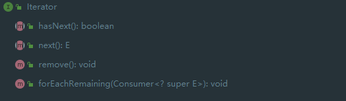

# JDK

JDK源码分析相关案例

# JDK概念


## JVM

JVM全称Java Virtual
Mechinal，即Java虚拟机。JVM是驻留于内存中的抽象计算机，可以理解为一个虚拟的计算机，它是通过在真实计算机上仿真模拟各种计算机功能来实现的，具有处理器、堆栈、寄存器等完善的硬件架构以及响应的指令系统，通过抽象CPU和操作系统结构，使代码的执行与主机硬件、主机操作系统无关。

JVM关注的是Java字节码文件（类文件.class），Java字节码文件由JVM指令集、符号表以及一些补充信息组成。JVM的主要工作是将Java字节码解释为本地机器码，实际就是将自己的指令集（Java字节码）映射为本地CPU的指令集或操作系统的接口调用（本地机器码）

Java语言的跨平台性，其实就是靠不同平台版本的JVM来实现的。不同的操作系统，使用不同的JVM映射规则，使Java字节码的解释执行与操作系统无关，从而完成跨平台（一次编译，到处执行）。也就是说，能跨平台的是Java程序，而JVM是不能跨平台的，对于不同的操作系统平台有不同的JVM实现，Java程序的跨平台性就是通过JVM的不跨平台实现的。

### JVM包含的组件

- 类加载器： 将类文件.class加载到内存中
- 字节码验证工具： 检查代码中是否存在访问限制违规
- 执行引擎： 将字节码转换为可执行的机器码
- JIT： Just-In-Time,即时编译，用于提高JVM的性能，加快Java程序的执行速度

### JVM版本

JVM 除了跨平台意义上的不同实现之外，还有很多不同的发行版，每个发行版通常都会有不同平台的实现。这些不同的发行版往往会有不同的特性，或针对不同的领域。

- HotSpot VM:这是最主流的JVM实现，可以说是”标准JVM“，Oracle JDK 以及 OpenJDK的各种变种版本 如 AdoptOpenJDK、Zulu、IcedTea等用的都是HotSpot VM
- OpenJ9 VM：OpenJ9最初由IBM开发，定位是企业级的开源JVM，2017年托管至Eclipse基金会并在GitHub上开源
- Zing VM：Azul在2010年发布的JVM，在HotSpot VM 基础上做了很多定制和优化工作

上述JVM主要是在JSE/JEE 领域的主流选择，而针对JME领域及Android或Android兼容系统也有诸如CLDC-HI、JavaCard、Sun
SPOT、OpenJ9（OpenJ9是一个高度模块化的JVM，在嵌入式、JME领域都可以应对）等实现。此外还有一些研究性质的JVM，如Graal VM、Jikes RVM、Maxine VM等

## JRE

JRE全称 Java Runtime Environment，即Java运行时环境，由运行和管理Java应用程序的类库和工具组成

JRE中包含了JVM，单纯的JVM不能运行Java程序，JVM在解释Java字节码时需要用到一些核心类库，这些核心类库就被包含在JRE中，简单来说JRE就是JVM+核心类库

除了JVM和核心类库之外，通常的JRE发行版中还会包含一些其他的工具和命令，如密钥库工具keytool、安全策略管理工具policytool、jar文件他所工具pack200/unpack200

## JDK

JDK 全称 Java Development Kit，即Java开发工具包，是面向Java开发人员使用的SDK（Software Development Kit，软件开发工具包），提供了Java程序的开发环境和运行环境

JDK包含了JRE、基础类库（Java
API，如网络、IO、线程、图形等）、Java源码编译器javac、以及其他的一系列用于开发、诊断、分析、调试、管理的工具和命令，如jar、javah、native2ascii、jdb、jconsole、jstat、jps、jmap、jhat等

> 从 Java 11 开始，安装 JDK 时不会直接安装 JRE，需要用户自行选择安装 JRE 模块，可以使用 `jlink`
> 程序生成，如：`bin\jlink.exe --module-path jmods --add-modules java.desktop --output jre` 。

JDK 有多个构建版本，而实际只有一组源代码，即 OpenJDK，使用分布式版本控制系统 Mercurial
托管在 [OpenJDK](https://link.zhihu.com/?target=http%3A//openjdk.java.net/projects/jdk/)
。任何人都可以获取这些源码，并用其构建一个变种版本进行发布。当然需要一个独有的认证程序来确保构建的变种版本是有效的，这个认证程序是由 [JCP（Java Community Process）](https://link.zhihu.com/?target=https%3A//www.jcp.org/en/home/index)
组织审核的，该组织会提供一套技术兼容性工具包 TCK（Technology Conformance Kit）。如果你构建了一个 OpenJDK 的变种版本，并通过了 TCK 的兼容性测试，则可以将该变种版本称为“Java SE
Compatible”（兼容 Java SE 的 JDK）。

### OpenJDK主流版本

- **[Oracle JDK](https://link.zhihu.com/?target=https%3A//www.oracle.com/technetwork/java/javase/downloads/index.html)**
  ：就是之前的 Sun JDK，被 Oracle 收购后命名为 Oracle JDK，由 Oracle 的团队维护。从 Java 11 开始提供付费的商业支持，当然个人或非商业用途仍然可以享受免费支持。但现阶段还没有单独针对 Oracle
  JDK 的付费策略，基本是和 Oracle 的其它商业产品绑定，Oracle 计划在 2026 年后提供全额付费的服务支持。
- **[Oracle OpenJDK](https://link.zhihu.com/?target=http%3A//openjdk.java.net/)**：免费的 OpenJDK 版本，基于 GPL
  协议开源，允许直接用于商业环境。Oracle 提交的源代码衍生出 Oracle JDK 和 Oracle OpenJDK 不同的编译版本，从 Java 11 开始，两者的特性差异已经最小化，差异部分大多是 Oracle 的商业特性。但
  Oracle OpenJDK 大版本发布后，Oracle 对其最多会有两次安全补丁的升级（发布后的六个月内），之后不再负责该大版本维护，如果用户想持续获得安全升级，需要及时更新到新的大版本。由于 Oracle OpenJDK
  是开源的，因此可以直接基于源码编译出社区版 JDK，甚至可以加入自定义特性并商业化。*值得一提的是，在安全补丁级别相同的情况下，Oracle JDK 并不比 OpenJDK 更好。如果不需要商业支持或企业管理工具，可以选择使用
  Oracle OpenJDK 构建版本。*
- **[AdoptOpenJDK](https://link.zhihu.com/?target=https%3A//adoptopenjdk.net/%3FjvmVariant%3Dhotspot)**：一个由社区驱动的项目，基于
  GPL 开源协议，以免费软件的形式提供社区版 OpenJDK 二进制包，与 Oracle OpenJDK 不同的是，该发行版会长期提供安全及其它补丁的更新，和 Java 11 一样，至少提供 4 年的免费长期支持（LTS）计划。IBM
  和 Red Hat 也曾表示提供相关安全补丁。
- **[AdoptOpenJDK OpenJ9](https://link.zhihu.com/?target=https%3A//adoptopenjdk.net/%3FjvmVariant%3Dopenj9)**：除了标准的
  OpenJDK 构建外，AdoptOpenJDK 还提供了使用 OpenJ9 VM 的版本。OpenJ9 是最初由 IBM 实现的
  JVM，现在由 [Eclipse 基金会](https://link.zhihu.com/?target=https%3A//www.eclipse.org/openj9/)
  运作，并在 [GitHub](https://link.zhihu.com/?target=https%3A//github.com/eclipse/openj9) 上开源。
- **[Red Hat OpenJDK](https://link.zhihu.com/?target=https%3A//developers.redhat.com/products/openjdk/download)**：这是 Red
  Hat 提供的一个 OpenJDK 构建版本，提供商业付费支持，它通常被集成在 Red Hat 的操作系统中（RHEL, Red Hat Enterprise Linux）。
- **[Azul Zulu](https://link.zhihu.com/?target=https%3A//www.azul.com/downloads/zulu-community/)**：一个 OpenJDK
  的免费版本，同时也提供商业付费支持。
- **[IBM JDK](https://link.zhihu.com/?target=https%3A//developer.ibm.com/javasdk/downloads/)**：IBM 为 Java 8 及更早版本提供支持，另外
  IBM 还为 AdoptOpenJDK OpenJ9 版本提供商业付费支持。

除了上面所述之外，还有其它很多不同的构建版本，如阿里巴巴的 [Dragonwell](https://link.zhihu.com/?target=https%3A//github.com/alibaba/dragonwell8)，AWS
的 [Corretto](https://link.zhihu.com/?target=https%3A//aws.amazon.com/cn/corretto/) 等，此外不同的 Linux 发行版也会使用不同的方式内置
OpenJDK，如 [Ubuntu](https://link.zhihu.com/?target=https%3A//help.ubuntu.com/community/Java)
、[Debian](https://link.zhihu.com/?target=https%3A//wiki.debian.org/Java%23Java_and_Debian)
、[Fedora](https://link.zhihu.com/?target=https%3A//fedoraproject.org/wiki/Java%23Java_packages_in_Fedora)
、[Arch](https://link.zhihu.com/?target=https%3A//wiki.archlinux.org/index.php/java%23Officially_supported_packages)
等，而如果要追求“标准”，最好的建议是使用 Oracle OpenJDK、AdoptOpenJDk 以及 Linux 发行版中内置的构建版本。

# 集合类


## Iterable

```java
/*
 * Copyright (c) 2003, 2013, Oracle and/or its affiliates. All rights reserved.
 * ORACLE PROPRIETARY/CONFIDENTIAL. Use is subject to license terms.
 */
package java.lang;

import java.util.Iterator;
import java.util.Objects;
import java.util.Spliterator;
import java.util.Spliterators;
import java.util.function.Consumer;

/**
 * 实现此接口允许对象成为“for-each 循环”语句的目标,请参阅 For-each 循环
 */
public interface Iterable<T> {
    /**
     * 返回 T 类型元素的迭代器
     *
     * @return an Iterator.
     */
    Iterator<T> iterator();

    /**
     * 对 Iterable 的每个元素执行给定的操作，直到处理完所有元素或该操作引发异常。除非实现类另有规定，否则按迭代顺序执行操作（如果指定了迭代顺序）.
     * 操作引发的异常将转发给调用者。
     *
     * @implSpec
     * <p>The default implementation behaves as if:
     * <pre>{@code
     *     for (T t : this)
     *         action.accept(t);
     * }</pre>
     *
     * @param action 为每个元素执行的操作
     * @throws NullPointerException – 如果指定的操作为空
     * @since 1.8
     */
    default void forEach(Consumer<? super T> action) {
        Objects.requireNonNull(action);
        for (T t : this) {
            action.accept(t);
        }
    }

    /**
     * 在此 Iterable 描述的元素上创建 Spliterator。
     *
     * @implSpec
     * 要求：默认实现从可迭代的迭代器创建一个早期绑定拆分器。 spliterator 继承了 iterable 的 iterator 的 fail-fast 属性。
     *
     * @implNote
     * 默认实现通常应该被覆盖。默认实现返回的拆分器的拆分能力很差，没有大小，并且不报告任何拆分器特征。实现类几乎总能提供更好的实现。
     *
     * @return 在此 Iterable 描述的元素上的 Spliterator。
     * @since 1.8
     */
    default Spliterator<T> spliterator() {
        return Spliterators.spliteratorUnknownSize(iterator(), 0);
    }
}

```

### Iterator



- hashNext() 返回true 如果迭代具有更多的元素
- next() 返回迭代中的下一个元素
- remove() 从基础集合中移除这个迭代器返回的最后一个元素
- forEachRemaining(Consumer<? super E>) 执行给定的每个剩余元素的动作，直到所有的元素都被处理或操作抛出异常

迭代器绑定后对数据集合的修改会报ConcurrentModificationException异常。

```java
package com.hollyland.Iterator;

import java.util.ArrayList;
import java.util.Iterator;
import java.util.List;

/**
 * @ClassName IteratorTest
 * @Description TODO
 * @Author wangqiang
 * @Date 2022/9/7 10:04
 **/
public class IteratorTest {
    public static void main(String[] args) {
        List<String> fruit = new ArrayList<>();
        fruit.add("apple");
        fruit.add("banana");
        fruit.add("strawberry");
        fruit.add("cherryBomb");
        fruit.add("watermelon");
        System.out.println("当前的list= " + fruit);
        Iterator<String> iterator = fruit.iterator();
        System.out.println("传统的迭代器");
        while (iterator.hasNext()) {
            String str = iterator.next();
            System.out.println(str + " ");
            if (str.equals("apple")) {
                iterator.remove();
            }
        }
        System.out.println();

        System.out.println("使用Iterator的forEachRemaining方法第一次");
        iterator.forEachRemaining(System.out::println);
        System.out.println();

        System.out.println("使用Iterator的forEachRemaining方法第二次");
        iterator.forEachRemaining(System.out::println);
        System.out.println();

        System.out.println("直接使用顶级接口forEach方法");
        fruit.forEach(System.out::println);
    }
}

```

### Spliterator


#### 嵌套类摘要

- Spliterator.OfPrimitive 专用于原始值的Spliterator
- Spliterator.OfInt 专用于Int值的Spliterator
- Spliterator.OfLong 专用于Long值的Spliterator
- Spliterator.OfDouble 专用于Double值的Spliterator

#### 方法摘要

- tryAdvance(Consumer<? super T> action):boolean
    - 如果剩余元素存在，执行特定的动作的话，返回true；否则返回false
- forEachRemaining(Consumer <? super T> action):void
    - 对每个剩余元素执行给定的操作，在当前线程中顺序执行，直到所有的元素都被处理或操作抛出异常。
- trySplit():Spliterator
    - 如果这spliterator可以分割，返回一个spliterator覆盖的元素，将这一方法，在回归，不是这个spliterator覆盖。
    - 分割迭代器，每调用一次，将原来的迭代器等分为两份，并返回索引靠前的那一个子迭代器。
- estimateSize():long
    - 返回的元素，返回 forEachRemaining 遍历将遇到的元素数量的估计值，如果无限、未知或计算过于昂贵，则返回 Long.MAX_VALUE。
- getExactSizeIfKnown():long
    - 如果此 Spliterator 为 SIZED，则返回 estimateSize() 的便捷方法，否则返回 -1。
- characteristics():int
    - 返回此 Spliterator 及其元素的一组特征。结果表示为 ORDERED、DISTINCT、SORTED、SIZED、NONNULL、IMMUTABLE、CONCURRENT、SUBSIZED 的 ORed
      值。在给定拆分器上重复调用特性（），在调用 trySplit 之前或之间，应该总是返回相同的结果
- hasCharacteristics():boolean
    - 如果此 Spliterator 的特征包含所有给定特征，则返回 true。
- getComparator():Comparator
    - 如果此 Spliterator 的源由 Comparator 排序，则返回该 Comparator。如果源按自然顺序排序，则返回 null。否则，如果源未排序，则抛出 IllegalStateException。

#### 字段摘要

- ORDERED 迭代器按照原始顺序迭代元素
- DISTINCT 迭代器中的元素是没有重复的
- SORTED 迭代器是按照某种方式排序的顺序迭代器
- SIZED 迭代器迭代元素的个数是有界的
- NONNULL 迭代器迭代的元素值不为null
- IMMUTABLE 迭代器迭代的元素是不能改变的
- CONCURRENT 迭代器的数据源是线程安全的
- SUBSIZED 迭代器所有的子迭代器（直接的或者间接的），有序的

以实现类为例


```java
 @Override
public Spliterator<E> spliterator(){
    return new ArrayListSpliterator<>(this,0,-1,0);
    }

/** Index-based split-by-two, lazily initialized Spliterator */
static final class ArrayListSpliterator<E> implements Spliterator<E> {

    private final ArrayList<E> list;
    private int index; // current index, modified on advance/split
    private int fence; // -1 until used; then one past last index
    private int expectedModCount; // initialized when fence set

    /** Create new spliterator covering the given  range */
    ArrayListSpliterator(ArrayList<E> list, int origin, int fence,
                         int expectedModCount) {
        this.list = list; // OK if null unless traversed
        this.index = origin;
        this.fence = fence;
        this.expectedModCount = expectedModCount;
    }

```

- list 数据集合
- index 起始位置 ，会被advance和split函数修改
- fence 代表当前结束位置的最后一个小标，-1表示第一次使用，然后指最后一个索引
- expectedModCount 设置围栏时初始化 expectedModCount存放了当该迭代器所对应的ArrayList的modCount来保证迭代器在迭代数据中原本数组中的数据并没有发生变化,该变量会被fence更改。

estimateSize()，用来估算将要迭代的元素的数量。characteristics()返回特征值。

```java
        private int getFence(){ // initialize fence to size on first use
    int hi; // (a specialized variant appears in method forEach)
    ArrayList<E> lst;
    if((hi=fence)< 0){
    if((lst=list)==null)
    hi=fence=0;
    else{
    expectedModCount=lst.modCount;
    hi=fence=lst.size;
    }
    }
    return hi;
    }

public ArrayListSpliterator<E> trySplit(){
    int hi=getFence(),lo=index,mid=(lo+hi)>>>1;
    return(lo>=mid)?null: // divide range in half unless too small
    new ArrayListSpliterator<E>(list,lo,index=mid,
    expectedModCount);
    }
```

getFence()，会确定当前的迭代器的最后分隔下标，如果是-1，则代表此次是第一次使用，更新当前迭代器的expectedModCount为对应容器的modCount，同时更新fence为对应容器的size。

trySplit()每次分割，都将原来的迭代器等分为两个，并返回索引靠前的那个,除非实在太小，正常是二分。

```java
        public boolean tryAdvance(Consumer<? super E>action){
    if(action==null)
    throw new NullPointerException();
    int hi=getFence(),i=index;
    if(i<hi){
    index=i+1;
@SuppressWarnings("unchecked") E e=(E)list.elementData[i];
    action.accept(e);
    if(list.modCount!=expectedModCount)
    throw new ConcurrentModificationException();
    return true;
    }
    return false;
    }

public void forEachRemaining(Consumer<? super E>action){
    int i,hi,mc; // hoist accesses and checks from loop
    ArrayList<E> lst;Object[]a;
    if(action==null)
    throw new NullPointerException();
    if((lst=list)!=null&&(a=lst.elementData)!=null){
    if((hi=fence)< 0){
    mc=lst.modCount;
    hi=lst.size;
    }
    else
    mc=expectedModCount;
    if((i=index)>=0&&(index=hi)<=a.length){
    for(;i<hi; ++i){
@SuppressWarnings("unchecked") E e=(E)a[i];
    action.accept(e);
    }
    if(lst.modCount==mc)
    return;
    }
    }
    throw new ConcurrentModificationException();
    }
```

tryAdvance()数组的ModCount进行验证。

forEachRemaining()，这里是一次性对所有数据进行操作。

### ListIterator

Iterator只为我们提供remove方法，如果要添加元素，可以使用ListIterator，它继承了Iterator，提供add与set操作。ListIterator是List的特有迭代器
