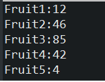

# JDK

JDK源码分析相关案例

# JDK概念


## JVM

JVM全称Java Virtual
Mechinal，即Java虚拟机。JVM是驻留于内存中的抽象计算机，可以理解为一个虚拟的计算机，它是通过在真实计算机上仿真模拟各种计算机功能来实现的，具有处理器、堆栈、寄存器等完善的硬件架构以及响应的指令系统，通过抽象CPU和操作系统结构，使代码的执行与主机硬件、主机操作系统无关。

JVM关注的是Java字节码文件（类文件.class），Java字节码文件由JVM指令集、符号表以及一些补充信息组成。JVM的主要工作是将Java字节码解释为本地机器码，实际就是将自己的指令集（Java字节码）映射为本地CPU的指令集或操作系统的接口调用（本地机器码）

Java语言的跨平台性，其实就是靠不同平台版本的JVM来实现的。不同的操作系统，使用不同的JVM映射规则，使Java字节码的解释执行与操作系统无关，从而完成跨平台（一次编译，到处执行）。也就是说，能跨平台的是Java程序，而JVM是不能跨平台的，对于不同的操作系统平台有不同的JVM实现，Java程序的跨平台性就是通过JVM的不跨平台实现的。

### JVM包含的组件

- 类加载器： 将类文件.class加载到内存中
- 字节码验证工具： 检查代码中是否存在访问限制违规
- 执行引擎： 将字节码转换为可执行的机器码
- JIT： Just-In-Time,即时编译，用于提高JVM的性能，加快Java程序的执行速度

### JVM版本

JVM 除了跨平台意义上的不同实现之外，还有很多不同的发行版，每个发行版通常都会有不同平台的实现。这些不同的发行版往往会有不同的特性，或针对不同的领域。

- HotSpot VM:这是最主流的JVM实现，可以说是”标准JVM“，Oracle JDK 以及 OpenJDK的各种变种版本 如 AdoptOpenJDK、Zulu、IcedTea等用的都是HotSpot VM
- OpenJ9 VM：OpenJ9最初由IBM开发，定位是企业级的开源JVM，2017年托管至Eclipse基金会并在GitHub上开源
- Zing VM：Azul在2010年发布的JVM，在HotSpot VM 基础上做了很多定制和优化工作

上述JVM主要是在JSE/JEE 领域的主流选择，而针对JME领域及Android或Android兼容系统也有诸如CLDC-HI、JavaCard、Sun
SPOT、OpenJ9（OpenJ9是一个高度模块化的JVM，在嵌入式、JME领域都可以应对）等实现。此外还有一些研究性质的JVM，如Graal VM、Jikes RVM、Maxine VM等

## JRE

JRE全称 Java Runtime Environment，即Java运行时环境，由运行和管理Java应用程序的类库和工具组成

JRE中包含了JVM，单纯的JVM不能运行Java程序，JVM在解释Java字节码时需要用到一些核心类库，这些核心类库就被包含在JRE中，简单来说JRE就是JVM+核心类库

除了JVM和核心类库之外，通常的JRE发行版中还会包含一些其他的工具和命令，如密钥库工具keytool、安全策略管理工具policytool、jar文件他所工具pack200/unpack200

## JDK

JDK 全称 Java Development Kit，即Java开发工具包，是面向Java开发人员使用的SDK（Software Development Kit，软件开发工具包），提供了Java程序的开发环境和运行环境

JDK包含了JRE、基础类库（Java
API，如网络、IO、线程、图形等）、Java源码编译器javac、以及其他的一系列用于开发、诊断、分析、调试、管理的工具和命令，如jar、javah、native2ascii、jdb、jconsole、jstat、jps、jmap、jhat等

> 从 Java 11 开始，安装 JDK 时不会直接安装 JRE，需要用户自行选择安装 JRE 模块，可以使用 `jlink`
> 程序生成，如：`bin\jlink.exe --module-path jmods --add-modules java.desktop --output jre` 。

JDK 有多个构建版本，而实际只有一组源代码，即 OpenJDK，使用分布式版本控制系统 Mercurial
托管在 [OpenJDK](https://link.zhihu.com/?target=http%3A//openjdk.java.net/projects/jdk/)
。任何人都可以获取这些源码，并用其构建一个变种版本进行发布。当然需要一个独有的认证程序来确保构建的变种版本是有效的，这个认证程序是由 [JCP（Java Community Process）](https://link.zhihu.com/?target=https%3A//www.jcp.org/en/home/index)
组织审核的，该组织会提供一套技术兼容性工具包 TCK（Technology Conformance Kit）。如果你构建了一个 OpenJDK 的变种版本，并通过了 TCK 的兼容性测试，则可以将该变种版本称为“Java SE
Compatible”（兼容 Java SE 的 JDK）。

### OpenJDK主流版本

- **[Oracle JDK](https://link.zhihu.com/?target=https%3A//www.oracle.com/technetwork/java/javase/downloads/index.html)**
  ：就是之前的 Sun JDK，被 Oracle 收购后命名为 Oracle JDK，由 Oracle 的团队维护。从 Java 11 开始提供付费的商业支持，当然个人或非商业用途仍然可以享受免费支持。但现阶段还没有单独针对 Oracle
  JDK 的付费策略，基本是和 Oracle 的其它商业产品绑定，Oracle 计划在 2026 年后提供全额付费的服务支持。
- **[Oracle OpenJDK](https://link.zhihu.com/?target=http%3A//openjdk.java.net/)**：免费的 OpenJDK 版本，基于 GPL
  协议开源，允许直接用于商业环境。Oracle 提交的源代码衍生出 Oracle JDK 和 Oracle OpenJDK 不同的编译版本，从 Java 11 开始，两者的特性差异已经最小化，差异部分大多是 Oracle 的商业特性。但
  Oracle OpenJDK 大版本发布后，Oracle 对其最多会有两次安全补丁的升级（发布后的六个月内），之后不再负责该大版本维护，如果用户想持续获得安全升级，需要及时更新到新的大版本。由于 Oracle OpenJDK
  是开源的，因此可以直接基于源码编译出社区版 JDK，甚至可以加入自定义特性并商业化。*值得一提的是，在安全补丁级别相同的情况下，Oracle JDK 并不比 OpenJDK 更好。如果不需要商业支持或企业管理工具，可以选择使用
  Oracle OpenJDK 构建版本。*
- **[AdoptOpenJDK](https://link.zhihu.com/?target=https%3A//adoptopenjdk.net/%3FjvmVariant%3Dhotspot)**：一个由社区驱动的项目，基于
  GPL 开源协议，以免费软件的形式提供社区版 OpenJDK 二进制包，与 Oracle OpenJDK 不同的是，该发行版会长期提供安全及其它补丁的更新，和 Java 11 一样，至少提供 4 年的免费长期支持（LTS）计划。IBM
  和 Red Hat 也曾表示提供相关安全补丁。
- **[AdoptOpenJDK OpenJ9](https://link.zhihu.com/?target=https%3A//adoptopenjdk.net/%3FjvmVariant%3Dopenj9)**：除了标准的
  OpenJDK 构建外，AdoptOpenJDK 还提供了使用 OpenJ9 VM 的版本。OpenJ9 是最初由 IBM 实现的
  JVM，现在由 [Eclipse 基金会](https://link.zhihu.com/?target=https%3A//www.eclipse.org/openj9/)
  运作，并在 [GitHub](https://link.zhihu.com/?target=https%3A//github.com/eclipse/openj9) 上开源。
- **[Red Hat OpenJDK](https://link.zhihu.com/?target=https%3A//developers.redhat.com/products/openjdk/download)**：这是 Red
  Hat 提供的一个 OpenJDK 构建版本，提供商业付费支持，它通常被集成在 Red Hat 的操作系统中（RHEL, Red Hat Enterprise Linux）。
- **[Azul Zulu](https://link.zhihu.com/?target=https%3A//www.azul.com/downloads/zulu-community/)**：一个 OpenJDK
  的免费版本，同时也提供商业付费支持。
- **[IBM JDK](https://link.zhihu.com/?target=https%3A//developer.ibm.com/javasdk/downloads/)**：IBM 为 Java 8 及更早版本提供支持，另外
  IBM 还为 AdoptOpenJDK OpenJ9 版本提供商业付费支持。

除了上面所述之外，还有其它很多不同的构建版本，如阿里巴巴的 [Dragonwell](https://link.zhihu.com/?target=https%3A//github.com/alibaba/dragonwell8)，AWS
的 [Corretto](https://link.zhihu.com/?target=https%3A//aws.amazon.com/cn/corretto/) 等，此外不同的 Linux 发行版也会使用不同的方式内置
OpenJDK，如 [Ubuntu](https://link.zhihu.com/?target=https%3A//help.ubuntu.com/community/Java)
、[Debian](https://link.zhihu.com/?target=https%3A//wiki.debian.org/Java%23Java_and_Debian)
、[Fedora](https://link.zhihu.com/?target=https%3A//fedoraproject.org/wiki/Java%23Java_packages_in_Fedora)
、[Arch](https://link.zhihu.com/?target=https%3A//wiki.archlinux.org/index.php/java%23Officially_supported_packages)
等，而如果要追求“标准”，最好的建议是使用 Oracle OpenJDK、AdoptOpenJDk 以及 Linux 发行版中内置的构建版本。

# 集合类


## Iterable

```java
/*
 * Copyright (c) 2003, 2013, Oracle and/or its affiliates. All rights reserved.
 * ORACLE PROPRIETARY/CONFIDENTIAL. Use is subject to license terms.
 */
package java.lang;

import java.util.Iterator;
import java.util.Objects;
import java.util.Spliterator;
import java.util.Spliterators;
import java.util.function.Consumer;

/**
 * 实现此接口允许对象成为“for-each 循环”语句的目标,请参阅 For-each 循环
 */
public interface Iterable<T> {
    /**
     * 返回 T 类型元素的迭代器
     *
     * @return an Iterator.
     */
    Iterator<T> iterator();

    /**
     * 对 Iterable 的每个元素执行给定的操作，直到处理完所有元素或该操作引发异常。除非实现类另有规定，否则按迭代顺序执行操作（如果指定了迭代顺序）.
     * 操作引发的异常将转发给调用者。
     *
     * @implSpec
     * <p>The default implementation behaves as if:
     * <pre>{@code
     *     for (T t : this)
     *         action.accept(t);
     * }</pre>
     *
     * @param action 为每个元素执行的操作
     * @throws NullPointerException – 如果指定的操作为空
     * @since 1.8
     */
    default void forEach(Consumer<? super T> action) {
        Objects.requireNonNull(action);
        for (T t : this) {
            action.accept(t);
        }
    }

    /**
     * 在此 Iterable 描述的元素上创建 Spliterator。
     *
     * @implSpec
     * 要求：默认实现从可迭代的迭代器创建一个早期绑定拆分器。 spliterator 继承了 iterable 的 iterator 的 fail-fast 属性。
     *
     * @implNote
     * 默认实现通常应该被覆盖。默认实现返回的拆分器的拆分能力很差，没有大小，并且不报告任何拆分器特征。实现类几乎总能提供更好的实现。
     *
     * @return 在此 Iterable 描述的元素上的 Spliterator。
     * @since 1.8
     */
    default Spliterator<T> spliterator() {
        return Spliterators.spliteratorUnknownSize(iterator(), 0);
    }
}

```

### Iterator


- hashNext() 返回true 如果迭代具有更多的元素
- next() 返回迭代中的下一个元素
- remove() 从基础集合中移除这个迭代器返回的最后一个元素
- forEachRemaining(Consumer<? super E>) 执行给定的每个剩余元素的动作，直到所有的元素都被处理或操作抛出异常

迭代器绑定后对数据集合的修改会报ConcurrentModificationException异常。

```java
package com.hollyland.Iterator;

import java.util.ArrayList;
import java.util.Iterator;
import java.util.List;

/**
 * @ClassName IteratorTest
 * @Description TODO
 * @Author wangqiang
 * @Date 2022/9/7 10:04
 **/
public class IteratorTest {
    public static void main(String[] args) {
        List<String> fruit = new ArrayList<>();
        fruit.add("apple");
        fruit.add("banana");
        fruit.add("strawberry");
        fruit.add("cherryBomb");
        fruit.add("watermelon");
        System.out.println("当前的list= " + fruit);
        Iterator<String> iterator = fruit.iterator();
        System.out.println("传统的迭代器");
        while (iterator.hasNext()) {
            String str = iterator.next();
            System.out.println(str + " ");
            if (str.equals("apple")) {
                iterator.remove();
            }
        }
        System.out.println();

        System.out.println("使用Iterator的forEachRemaining方法第一次");
        iterator.forEachRemaining(System.out::println);
        System.out.println();

        System.out.println("使用Iterator的forEachRemaining方法第二次");
        iterator.forEachRemaining(System.out::println);
        System.out.println();

        System.out.println("直接使用顶级接口forEach方法");
        fruit.forEach(System.out::println);
    }
}

```

### Spliterator


#### 嵌套类摘要

- Spliterator.OfPrimitive 专用于原始值的Spliterator
- Spliterator.OfInt 专用于Int值的Spliterator
- Spliterator.OfLong 专用于Long值的Spliterator
- Spliterator.OfDouble 专用于Double值的Spliterator

#### 方法摘要

- tryAdvance(Consumer<? super T> action):boolean
    - 如果剩余元素存在，执行特定的动作的话，返回true；否则返回false
- forEachRemaining(Consumer <? super T> action):void
    - 对每个剩余元素执行给定的操作，在当前线程中顺序执行，直到所有的元素都被处理或操作抛出异常。
- trySplit():Spliterator
    - 如果这spliterator可以分割，返回一个spliterator覆盖的元素，将这一方法，在回归，不是这个spliterator覆盖。
    - 分割迭代器，每调用一次，将原来的迭代器等分为两份，并返回索引靠前的那一个子迭代器。
- estimateSize():long
    - 返回的元素，返回 forEachRemaining 遍历将遇到的元素数量的估计值，如果无限、未知或计算过于昂贵，则返回 Long.MAX_VALUE。
- getExactSizeIfKnown():long
    - 如果此 Spliterator 为 SIZED，则返回 estimateSize() 的便捷方法，否则返回 -1。
- characteristics():int
    - 返回此 Spliterator 及其元素的一组特征。结果表示为 ORDERED、DISTINCT、SORTED、SIZED、NONNULL、IMMUTABLE、CONCURRENT、SUBSIZED 的 ORed
      值。在给定拆分器上重复调用特性（），在调用 trySplit 之前或之间，应该总是返回相同的结果
- hasCharacteristics():boolean
    - 如果此 Spliterator 的特征包含所有给定特征，则返回 true。
- getComparator():Comparator
    - 如果此 Spliterator 的源由 Comparator 排序，则返回该 Comparator。如果源按自然顺序排序，则返回 null。否则，如果源未排序，则抛出 IllegalStateException。

#### 字段摘要

- ORDERED 迭代器按照原始顺序迭代元素
- DISTINCT 迭代器中的元素是没有重复的
- SORTED 迭代器是按照某种方式排序的顺序迭代器
- SIZED 迭代器迭代元素的个数是有界的
- NONNULL 迭代器迭代的元素值不为null
- IMMUTABLE 迭代器迭代的元素是不能改变的
- CONCURRENT 迭代器的数据源是线程安全的
- SUBSIZED 迭代器所有的子迭代器（直接的或者间接的），有序的

以实现类为例


```java
 @Override
public Spliterator<E> spliterator(){
    return new ArrayListSpliterator<>(this,0,-1,0);
    }

/** Index-based split-by-two, lazily initialized Spliterator */
static final class ArrayListSpliterator<E> implements Spliterator<E> {

    private final ArrayList<E> list;
    private int index; // current index, modified on advance/split
    private int fence; // -1 until used; then one past last index
    private int expectedModCount; // initialized when fence set

    /** Create new spliterator covering the given  range */
    ArrayListSpliterator(ArrayList<E> list, int origin, int fence,
                         int expectedModCount) {
        this.list = list; // OK if null unless traversed
        this.index = origin;
        this.fence = fence;
        this.expectedModCount = expectedModCount;
    }

```

- list 数据集合
- index 起始位置 ，会被advance和split函数修改
- fence 代表当前结束位置的最后一个小标，-1表示第一次使用，然后指最后一个索引
- expectedModCount 设置围栏时初始化 expectedModCount存放了当该迭代器所对应的ArrayList的modCount来保证迭代器在迭代数据中原本数组中的数据并没有发生变化,该变量会被fence更改。

estimateSize()，用来估算将要迭代的元素的数量。characteristics()返回特征值。

```java
        private int getFence(){ // initialize fence to size on first use
    int hi; // (a specialized variant appears in method forEach)
    ArrayList<E> lst;
    if((hi=fence)< 0){
    if((lst=list)==null)
    hi=fence=0;
    else{
    expectedModCount=lst.modCount;
    hi=fence=lst.size;
    }
    }
    return hi;
    }

public ArrayListSpliterator<E> trySplit(){
    int hi=getFence(),lo=index,mid=(lo+hi)>>>1;
    return(lo>=mid)?null: // divide range in half unless too small
    new ArrayListSpliterator<E>(list,lo,index=mid,
    expectedModCount);
    }
```

getFence()，会确定当前的迭代器的最后分隔下标，如果是-1，则代表此次是第一次使用，更新当前迭代器的expectedModCount为对应容器的modCount，同时更新fence为对应容器的size。

trySplit()每次分割，都将原来的迭代器等分为两个，并返回索引靠前的那个,除非实在太小，正常是二分。

```java
        public boolean tryAdvance(Consumer<? super E>action){
    if(action==null)
    throw new NullPointerException();
    int hi=getFence(),i=index;
    if(i<hi){
    index=i+1;
@SuppressWarnings("unchecked") E e=(E)list.elementData[i];
    action.accept(e);
    if(list.modCount!=expectedModCount)
    throw new ConcurrentModificationException();
    return true;
    }
    return false;
    }

public void forEachRemaining(Consumer<? super E>action){
    int i,hi,mc; // hoist accesses and checks from loop
    ArrayList<E> lst;Object[]a;
    if(action==null)
    throw new NullPointerException();
    if((lst=list)!=null&&(a=lst.elementData)!=null){
    if((hi=fence)< 0){
    mc=lst.modCount;
    hi=lst.size;
    }
    else
    mc=expectedModCount;
    if((i=index)>=0&&(index=hi)<=a.length){
    for(;i<hi; ++i){
@SuppressWarnings("unchecked") E e=(E)a[i];
    action.accept(e);
    }
    if(lst.modCount==mc)
    return;
    }
    }
    throw new ConcurrentModificationException();
    }
```

tryAdvance()数组的ModCount进行验证。

forEachRemaining()，这里是一次性对所有数据进行操作。

### ListIterator

Iterator只为我们提供remove方法，如果要添加元素，可以使用ListIterator，它继承了Iterator，提供add与set操作。ListIterator是List的特有迭代器


```java
package com.hollyland.Iterator;

import java.util.ArrayList;
import java.util.List;
import java.util.ListIterator;

/**
 * @ClassName ListIteratorTest
 * @Description TODO
 * @Author wangqiang
 * @Date 2022/9/7 13:47
 **/
public class ListIteratorTest {
    public static void main(String[] args) {
        List<String> fruit = new ArrayList<>();
        fruit.add("apple");
        fruit.add("banana");
        fruit.add("strawberry");
        fruit.add("cherryBomb");
        fruit.add("watermelon");
        System.out.println("原始 ：" + fruit);

        ListIterator<String> stringListIterator = fruit.listIterator();
        while (stringListIterator.hasNext()) {
            if ("watermelon".equals(stringListIterator.next())) {
                stringListIterator.set("pear");
                stringListIterator.add("peach");
            }
        }

        System.out.println("处理后:" + fruit);
    }
}
```


## Collection


- 添加
  - add(E):boolean 添加对象到集合
  - addAll(Collection< ? extends E>):boolean 将指定集合中的所有元素添加到这个集合（可选操作）。 
- 删除
  - clear():void 从这个集合中移除所有的元素（可选操作）。 
  - remove(Object):boolean 从这个集合中移除指定元素的一个实例，如果它是存在的（可选操作）。 
  - removeAll(Collection<?>) 删除此集合中包含的所有元素（可选操作）的所有元素（可选操作）。  
  - retainAll(Collection<?>) 仅保留包含在指定集合中的这个集合中的元素（可选操作）。
  - removeIf(Predicate<? super E>):boolean 删除满足给定谓词的这个集合的所有元素。
- 判断
  - isEmpty():boolean 返回true如果集合不包含任何元素。 
  - contais(Object):boolean 返回true如果集合包含指定元素。 
  - containsAll(Collection<?>):boolean 返回true如果这个集合包含指定集合的所有元素。
- 获取数量
  - size():int 返回此集合中的元素的数目。 
- 获取集合元素
  - interator():Iterator 返回此集合中的元素的迭代器。
  - spliterator():Spliterator 创建此集合中的元素的Spliterator
- 标识 
  - hashCode():int 返回此集合的哈希代码值。
  - equals():boolean 将指定的对象与此集合进行比较，以进行相等性。 
- 将集合变成数组
  - toArray():Object[] 返回包含此集合中所有元素的数组。
  - toArray(T[]):T[] 返回包含此集合中所有元素的数组；返回数组的运行时类型是指定的数组的运行时类型。
- Stream流
  - stream():Stream<E>  返回一个序列Stream与集合的来源。 
  - parallelStream():Stream<E> 返回一个可以并行Stream与集合的来源。它通过默认的ForkJoinPool,可能提高你的多线程任务的速度。

### List

list直接继承Collection


List集合是线性数据结构的主要实现，集合元素通常存在明确的上一个元素或下一个元素，也存在明确的第一个元素和最后一个元素。List集合的遍历结果是稳定的

### Set

Set直接继承Collection


Set不允许出现重复元素的集合类型。常用的如HashSet、TreeSet、LinkedHashSet。

### Queue

Queue直接继承Collection


Queue队列是一种先进先出的数据结构，是一种特殊的线性表，它只允许在表的一端进行获取，在表的另一端进行插入。没有元素时为空队列。


### parallelStream

parallelStream其实就是一个并行执行的流，它通过默认的ForkJoinPool，可能提高多线程任务的速度

#### parallelStream的作用

Stream具有平行处理能力，处理的过程会分而治之，也就是将一个大任务切分成多个小任务，这表示每个任务都是一个操作,因此像以下的程式片段：

```java
List<Integer> numbers = Arrays.asList(1,2,3,4,5,6,7,8,9);
numbers.parallelStream()
    .forEach(out::println);
```

得到展示顺序不一定是1、2、3、4、5、6、7、8、9，而可能是任意的顺序，就forEach()这个操作来讲，如果平行处理时，希望最后顺序是按照原来Stream的数据顺序，那可以调用forEachOrdered().

```java
List<Integer> numbers = Arrays.asList(1,2,3,4,5,6,7,8,9);
numbers.parallelStream()
    .forEachOrdered(out::println);
```

> 注意：如果forEachOrdered()中间有其他如filter()的中介操作，会试着平行化处理，然后最终forEachOrdered()会以原数据顺序处理，因此，使用forEachOrdered()这类的有序处理，可能会（或完全失去）时区平行化的一些优势，实际上中介操作亦有可能如此，例如sorted()方法。

#### parallelStream背后的实现：ForkJoinPool

ForkJoin框架是从JDK7中新特性，它同ThreadPoolExecutor一样，也实现了Executor和ExecutorService接口。它使用了一个无限队列来保存需要执行的任务，而线程的数量则是通过构造函数传入，如果没有向构造函数中传入希望的线程数量，那么当前计算机可用的CPU数量会被设置为线程数量作为默认值

ForkjoinPool主要用来使用分治法（Divide-and-Conquer Algorithm)来解决问题。典型的应用比如快速排序算法。这里的要点在于，ForkJoinPool需要使用相对少的线程来处理大量的任务。比如要对1000万个数据进行排序，那么会将这个任务分割成两个500万的排序任务和一个针对这两组500万数据的合并任务。以此类推，对于500万的数据也会做出同样的分割处理，到最后会设置一个阈值来规定当数据规模到多少时，停止这样的分割处理。比如，当元素的数量小于10时，会停止分割，转而使用插入排序对它们进行排序。那么到最后，所有的任务加起来会有大概2000000+个。问题的关键在于，对于一个任务而言，只有当它所有的子任务完成之后，它才能够被执行。

所以当使用ThreadPoolExecutor时，使用分治法会存在问题，因为ThreadPoolExecutor中的线程无法像任务队列中再添加一个任务并且在等待该任务完成之后再继续执行。而使用ForkJoin时，就能够让其中的线程创建新的任务，并挂起当前的任务，此时线程就能够从队列中选择子任务执行

#### 使用ThreadPoolExecutor或者ForkJoinPool，会有什么性能差异

首先，使用ForkJoinPool能够使用数量有限的线程来完成非常多的具有父子关系的任务，比如使用4个线程来完成超过200万个任务。但是，使用ThreadPoolExecutor时，是不可能完成的，因为ThreadPoolExecutor中的Thread无法选择优先执行子任务，需要完成200万个具有父子关系的任务时，也需要200万个线程，显然这是不可行的

#### 工作窃取算法

forkjoin最核心的地方就是利用了现代硬件设备多核，在一个操作时候会有空闲的cpu，那么如何利用好这个空闲的cpu就成了提高性能的关键，而这里工作窃取（work-stealing）算法就是整个forkjoin框架的核心理念，工作窃取算法是指某个线程从其他队列里窃取任务来执行

#### 为什么需要使用工作窃取算法

假如我们需要做一个比较大的任务，我们可以把这个任务分割成若干互不依赖的子任务，为了减少线程间的竞争，于是把这些子任务分别放到不同的队列里，并为每个队列创建一个单独的线程来执行队列里的任务，线程和队列一一对应，比如A线程负责处理A队列里的任务。但是有的线程会先把自己队列里的任务干完，而其他线程对应的队列里还有任务等待处理。干完活的线程与其等着，不如去帮其他线程干活，于是它就去其他线程的队列里窃取一个任务来执行。而再这时它们会访问同一个队列，所以为了减少窃取任务线程和被窃取任务线程之间的竞争，通常会使用双端队列，被窃取任务线程永远从双端队列的头部拿任务执行，而窃取任务的线程永远从双端队列的尾部那任务执行

> 工作窃取算法的有点是充分利用线程进行并行计算，并减少了线程间的竞争，其缺点是在某些情况下还是存在竞争，比如双端队列里只有一个任务时。并且小号了更多的系统资源，比如创建多个线程和多个双端队列

#### 用forkjoin的眼光来看ParallelStreams

上下文提到了在Java8引入了自动并行化的概念。它能让一部分Java代码自动地以并行地方式执行，也就是我们使用了ForkjoinPool地ParallelStream

Java8为ForkjoinPool添加了一个通用线程池，这个线程池用来处理那些没有被显式提交到热河线程池的任务。它是ForkjoinPool类型上的一个静态元素，它拥有的默认线程数量等于运行计算机上的处理器数量。当调用Arrays类上添加的新方法时，自动并行化就会发生。比如用来排序一个数组的并行快速排序，用来对一个数组中的元素进行并行遍历。自动化并行也被运用在Java8新添加的Stream API中。

比如下面的代码用来遍历列表中的元素并执行需要的操作

```java
List<UserInfo> userInfoList = DaoContainers.getUserInfoDAO().queryAllByList(new UserInfoModel());
userInfoList.parallelStream().forEach(RedisUserApi::setUserIdUserInfo);
```

对于列表中的元素的操作都会以并行的方式执行。forEach方法会为每个元素的计算操作创建一个任务，该任务会被前文中提到的ForkJoinPool中的通用线程池处理。以上的并行计算逻辑当然也可以使用ThreadPoolExecutor完成，但是就代码的可读性和代码量而言，使用ForkJoinPool明显更胜一筹

对于ForkjoinPool通用线程池的线程数量，通常使用默认值就可以了，即运行时计算机的处理器数量。我们这里提供了一个示例的代码让你了解JVM所使用的ForkjoinPool 的线程数量，可以通过设置系统属性:

-Djava.util.concurrent.ForkjoinPool.common.parallelism=N(N为线程数量)，来调整ForkjoinPool的线程数量，可以尝试调整成不同的参数来观察每次的输出结果

```java
package com.hollyland.stream.parallelStream;

import java.util.ArrayList;
import java.util.List;
import java.util.Set;
import java.util.concurrent.CopyOnWriteArraySet;
import java.util.concurrent.CountDownLatch;

/**
 * @ClassName parallelStreamTest
 * @Description 这是一个用来让你更加熟悉parallelStream的原理的实例
 * @Author wangqiang
 * @Date 2022/9/15 10:03
 **/
public class parallelStreamTest {
    public static void main(String[] args) throws InterruptedException {
        System.out.println("Hello world");
        // 构造一个10000个元素的集合
        List<Integer> list = new ArrayList<>();
        for (int i = 0; i < 10000; i++) {
            list.add(i);
        }
        // 统计并行执行list的线程
        Set<Thread> threadSet = new CopyOnWriteArraySet<>();
        // 并行执行
        list.parallelStream().forEach(integer -> {
            Thread thread = Thread.currentThread();
            // System.out.println(thread);
            // 统计并行执行List的线程
            threadSet.add(thread);
        });
        System.out.println("threadSet一共有 " + threadSet.size() + " 个线程");
        System.out.println("系统一共有 " + Runtime.getRuntime().availableProcessors() + " 个CPU");
        List<Integer> list1 = new ArrayList<>();
        List<Integer> list2 = new ArrayList<>();
        for (int i = 0; i < 10000; i++) {
            list1.add(i);
            list2.add(i);
        }
        Set<Thread> threadSetTwo = new CopyOnWriteArraySet<>();
        CountDownLatch countDownLatch = new CountDownLatch(2);
        Thread threadA = new Thread(() -> {
            list1.parallelStream().forEach(integer -> {
                Thread thread = Thread.currentThread();
                // System.out.println("list1 " + thread);
                threadSetTwo.add(thread);
            });
            countDownLatch.countDown();
        });
        Thread threadB = new Thread(() -> {
            list2.parallelStream().forEach(integer -> {
                Thread thread = Thread.currentThread();
                // System.out.println("list2 " + thread);
                threadSetTwo.add(thread);
            });
            countDownLatch.countDown();
        });
        threadA.start();
        threadB.start();
        countDownLatch.await();
        System.out.println("threadSetTwo一共有 " + threadSetTwo.size() + " 个线程");

        System.out.println("------------------------------------");
        System.out.println(threadSet);
        System.out.println(threadSetTwo);
        System.out.println("------------------------------------");
        threadSetTwo.addAll(threadSet);
        System.out.println(threadSetTwo);
        System.out.println("threadSetTwo一共有 " + threadSetTwo.size() + " 个线程");
        System.out.println("系统一共有 " + Runtime.getRuntime().availableProcessors() + " 个CPU");
    }
}
```


出现这种现象的原因是，forEach用了一些小把戏。它会将执行forEach本身的线程也作为线程池中的一个工作线程。因此，即使将ForkjoinPool的通用线程池的线程数量设置为1，实际上也会有2个工作线程。因此在使用forEach的时候，线程数为1的ForkjoinPool通用线程池和线程数为2的ThreadPoolExecutor是等价的。

所以当ForkjoinPool通用线程池实际需要4个工作线程时，可以将它设置成3，那么在运行时可用的工作线程就是4了

> 小结：
>
> 1. 当需要处理递归分治算法时，考虑使用ForkjoinPool
> 2. 仔细设置不再进行任务划分的阈值，这个阈值对性能有影响
> 3. Java 8 中的一些特性会使用到ForkjoinPool中的通用线程池。在某些场合下，需要调整该线程池的默认的线程数量

#### ParallelStreams的陷阱

parallelStream的程序都有可能称为阻塞程序的源头，并且在执行过程中的其他部分将无法访问这些workers，这意味着任何依赖parallelStream的程序在别的东西占用着common ForkjoinPool时将会变得不可预知并且暗藏危机

#### 如何正确的使用ParallelStream

一种方式是限制ForkjoinPool提供的并行数。可以通过-Djava.util.concurrent.ForkJoinPool.common.parallelism=1 来限制线程池的大小为1.不再从并行化中得到好处可以杜绝错误的使用（但是这个方法有问题，毕竟这样还不如不去使用并行流）

另一种方式就是，一个被称为工作区的可以让ForkJoinPool平行放置的parallelStream()实现。但是JDK还没有实现

Parallel stream 是无法预测的，而且想要正确地使用它有些棘手。几乎任何parallelstream的使用都会影响程序中无关部分的性能，而且是一种无法预测的方式。但是再调成stream.parallel()或者parallelStream()时候在我的代码里之前我仍然会重新审视一遍他给我的程序究竟会带来什么样的问题，他能有多大的提升，是否有使用他的意义

#### stream or parallelStream

上文我们看到了parallelStream所带来的隐患和好处，那么，在从stream和parallelStream方法中进行选择时，我们可以考虑以下几个问题

1. 是否需要并行
2. 任务之间是否是独立的？是否会引起任何竞态条件
3. 结果是否取决于任务的调用顺序

对于问题1，在回答这个问题之前，你需要弄清楚你要解决的问题是什么，数据量有多大，计算的特点是什么？并不是所有的问题都适合使用并发程序来求解，比如当数据量不大时，顺序执行往往比并行执行更快，毕竟，准备线程池和其他相关资源也是需要时间的。但是，当任务涉及到IO操作并且任务之间不互相依赖时，那么并行化就是一个不错的选择。通常而言，将这类程序并行化之后，执行速度会提升好几个等级

对于问题2，如果任务之间是相互独立的，并且代码中不涉及到对同一个对象的某个状态或者某个变量的更新操作，那么就表明代码是可以被并行化的

对于问题3，由于在并行环境中任务的执行顺序是不确定的，因此对于依赖于顺序的任务而言，并行化也许不能给出正确的答案


## Stream流

JDK8 为 Collection新添加了Stream流，跟我们以往的IO流或者XML处理中的流没有任何关系，是一个全新针对几何数据进行便捷高效的聚合操作与大批量数据处理操作

### 什么是流

Stream不是集合元素，它不是数据结构并不保存数据，它是有关算法和计算的，它更像一个高级版本的Iterator。原始版本的Iterator，用户只能显式地一个一个遍历元素并对其执行某些操作；高级版本的Stream，用户只要给出需要对其包含的元素执行什么操作，比如“过滤掉长度大于10的字符串”、“获取每个字符串的首字母”等，Stream会隐式地在内部进行遍历，做出相应的数据转换。Stream就如同一个迭代器（Iterator），单项，不可往复，数据只能遍历一次，遍历一次后即用尽了，就好像流水从面前流过，一去不复返。Stream的另外一大特点是，数据源本身可以是无限的

简单说，对Stream的使用就是实现一个filter-map-reduce过程，产生一个最终结果，或者导致一个副作用（side effect）

### 如何创建一个Stream流

集合接口有两个方法

- stream() - 为集合创建串行流
- parallelStream() - 为集合创建并行流

数组也可以创建,或者直接创建Stream类

```java
package com.hollyland.stream;

import java.util.Arrays;
import java.util.List;
import java.util.stream.Stream;

/**
 * @ClassName CreateStreamTest
 * @Description TODO
 * @Author wangqiang
 * @Date 2022/9/7 15:40
 **/
public class CreateStreamTest {
    public static void main(String[] args) {
        // 1.直接创建
        Stream<String> stream = Stream.of("a", "b", "c");
        // 2.数组创建Stream
        String[] strArray = {"a", "b", "c"};
        stream = Stream.of(strArray);
        stream = Arrays.stream(strArray);
        // 3.集合类方法创建
        List<String> list = Arrays.asList(strArray);
        stream = list.stream();
    }
}

```

Stream虽然支持Stream<Integer>、Stream<Long> 、Stream<Double>这样创建基本数据类型包装类，但是会在拆箱装箱耗费时间，所以Stream还提供了IntStream、LongStream、DoubleStream这三种常用的Stream包装类，其他的数据类型暂时还不支持。

### 如何对流进行操作

当我们将集合或者容器包装成Stream流时，我们就可以开始操作它了，流的操作类型分为两种

1. Intermediate：中间操作都会返回流对象本身。这样多个操作可以串联成一个管道，如同流式风格（fluent style）。这样做可以对操作进行优化，这类操作都是惰性化的（lazy），就是说，仅仅带哦用到这类方法，并没有真正开始流的遍历
2. Terminal： 一个流只能有一个terminal操作，当这个操作执行后，流就被使用“光”了，无法再被操作，一去不复返。所以这必定是流的最后一个操作。Terminal操作的执行，才会真正开始流的遍历，并且会生成一个结果，或者一个side effect

### 流常用的操作

#### Collectors

Collectors类实现了很多归纳操作，流转换为其他数据结构，例如将流转换成集合和聚合元素。这是一个Terminal操作

```java
package com.hollyland.stream.collectors;

import java.util.ArrayList;
import java.util.List;
import java.util.Set;
import java.util.Stack;
import java.util.stream.Collectors;
import java.util.stream.Stream;

/**
 * @ClassName CollectorsTest
 * @Description TODO
 * @Author wangqiang
 * @Date 2022/9/7 15:56
 **/
public class CollectorsTest {
    public static void main(String[] args) {
        // 1. Array
        Stream<String> stream1 = Stream.of("a", "b", "c");
        String[] strArray = stream1.toArray(String[]::new);
        // 2. Collection
        Stream<String> stream2 = Stream.of("a", "b", "c");
        List<String> list = stream2.collect(Collectors.toList());

        Stream<String> stream3 = Stream.of("a", "b", "c");
        ArrayList<String> list2 = stream3.collect(Collectors.toCollection(ArrayList::new));

        Stream<String> stream4 = Stream.of("a", "b", "c");
        Set<String> set = stream4.collect(Collectors.toSet());

        Stream<String> stream5 = Stream.of("a", "b", "c");
        Stack<String> stack1 = stream4.collect(Collectors.toCollection(Stack::new));

        // 3. String(joining标识合并字符串）
        Stream<String> stream6 = Stream.of("a", "b", "c");
        String str = stream6.collect(Collectors.joining()).toString();
    }
}
```

### map

map 方法用于映射每个元素到对应的结果,它的作用就是把 input Stream 的每一个元素，映射成 output Stream 的另外一个元素。

```java
package com.hollyland.stream.map;

import java.util.Arrays;
import java.util.List;
import java.util.stream.Collectors;

/**
 * @ClassName StreamOperationTest
 * @Description TODO
 * @Author wangqiang
 * @Date 2022/9/7 16:49
 **/
public class StreamOperationTest {
    public static void main(String[] args) {
        String[] strArray = {"a", "b", "c"};
        List<String> worldList = Arrays.asList(strArray);
        // 转换大小写
        List<String> output = worldList.stream()
            .map(String::toUpperCase)
            .collect(Collectors.toList());

        System.out.println(output);
    }
}
```

### flatMap 

flatMap把input Stream中的层级结构扁平化，就是将最底层元素抽出来放到一起，最终output的新Stream里面已经没有list了，都是直接的数字

```java
package com.hollyland.stream.flatMap;

import java.util.Arrays;
import java.util.Collection;
import java.util.List;
import java.util.stream.Collectors;
import java.util.stream.Stream;

/**
 * @ClassName StreamFlatMapTest
 * @Description TODO
 * @Author wangqiang
 * @Date 2022/9/7 18:21
 **/
public class StreamFlatMapTest {
    public static void main(String[] args) {
        Stream<List<Integer>> inputStream = Stream.of(
            Arrays.asList(1),
            Arrays.asList(2, 3),
            Arrays.asList(4, 5, 6)
        );
        List<Integer> outputStream = inputStream.
            flatMap(Collection::stream)
            .collect(Collectors.toList());
        System.out.println(outputStream);
    }
}
```

### filter

用于通过设置的条件过滤出元素

```java
package com.hollyland.stream.filter;

import java.util.Arrays;
import java.util.List;
import java.util.stream.Collectors;

/**
 * @ClassName FilterTest
 * @Description TODO
 * @Author wangqiang
 * @Date 2022/9/8 13:55
 **/
public class FilterTest {
    public static void main(String[] args) {
        List<String> strings = Arrays.asList("aa", "bb", "", "cc", "", "dd", "");
        // 过滤空白字符串
        List<String> notNullStrings = strings.stream()
            .filter(x -> !x.isEmpty())
            .collect(Collectors.toList());

        System.out.println(notNullStrings);
    }
}
```

### forEach

forEach方法接收一个Lamda表达式，然后在Stream的每一个元素上执行该表达式

```java
package com.hollyland.stream.forEach;

import java.util.ArrayList;
import java.util.List;

/**
 * @ClassName forEachTest
 * @Description TODO
 * @Author wangqiang
 * @Date 2022/9/8 14:01
 **/
public class forEachTest {
    public static void main(String[] args) {
        List<Fruit> fruitList = new ArrayList<>();
        Fruit fruit1 = new Fruit(1, "pear", "small", 11);
        Fruit fruit2 = new Fruit(2, "apple", "big", 11);
        Fruit fruit3 = new Fruit(3, "banana", "small", 11);
        Fruit fruit4 = new Fruit(4, "cherryBomb", "big", 11);
        Fruit fruit5 = new Fruit(5, "watermelon", "big", 11);
        fruitList.add(fruit1);
        fruitList.add(fruit2);
        fruitList.add(fruit3);
        fruitList.add(fruit4);
        fruitList.add(fruit5);
        // 获取type类型为big的水果名称并打印
        fruitList.stream()
            .filter(f -> "big".equals(f.getType()))
            .forEach(f -> System.out.println(f.getName()));
    }
}
```

forEach 是 terminal 操作，因此它执行后，Stream 的元素就一去不复返了，如果需要 intermediate 操作可以使用具有相似功能的 peek 。

### Peek

```java
package com.hollyland.stream.peek;

import com.hollyland.stream.forEach.Fruit;

import java.util.ArrayList;
import java.util.List;
import java.util.stream.Collectors;

/**
 * @ClassName PeekTest
 * @Description TODO
 * @Author wangqiang
 * @Date 2022/9/8 14:18
 **/
public class PeekTest {
    public static void main(String[] args) {
        List<Fruit> fruitList = new ArrayList<>();
        Fruit fruit1 = new Fruit(1, "pear", "small", 11);
        Fruit fruit2 = new Fruit(2, "apple", "big", 11);
        Fruit fruit3 = new Fruit(3, "banana", "small", 11);
        Fruit fruit4 = new Fruit(4, "cherryBomb", "big", 11);
        Fruit fruit5 = new Fruit(5, "watermelon", "big", 11);
        fruitList.add(fruit1);
        fruitList.add(fruit2);
        fruitList.add(fruit3);
        fruitList.add(fruit4);
        fruitList.add(fruit5);

        fruitList.stream()
            .filter(f -> "big".equals(f.getType()))
            .peek(fruit -> System.out.println(fruit.getName()))
            .peek(fruit -> {
                String upperString = fruit.getName().toUpperCase();
                fruit.setName(upperString);
            })
            .peek(fruit -> System.out.println(fruit.getName()))
            .collect(Collectors.toList());
    }
}
```

peek方法作为intermediate 操作可以被多次执行，注意如果缺少terminal 操作，那么前面的intermediate 操作都不会被执行，对比上述例子缺少最后一个collect操作时，将不会有任何水果被打印到控制台。

### reduce


这个方法的主要作用是把 Stream 元素组合起来。它提供一个起始值（种子），然后依照运算规则（BinaryOperator），和前面 Stream 的第一个、第二个、第 n 个元素组合。从这个意义上说，字符串拼接、数值的 sum、min、max、average 都是特殊的 reduce。例如 Stream 的 sum 就相当于：

Integer sum = integers.reduce(0, (a, b) -> a+b); 

或

Integer sum = integers.reduce(0, Integer::sum);

### limit/skip

limit返回Stream的前面n个元素，skip则是扔掉前n个元素

```java
package com.hollyland.stream.limitAndSkip;

import com.hollyland.stream.forEach.Fruit;

import java.util.ArrayList;
import java.util.List;
import java.util.stream.Collectors;

/**
 * @ClassName LimitAndSkipTets
 * @Description TODO
 * @Author wangqiang
 * @Date 2022/9/8 14:48
 **/
public class LimitAndSkipTest {
    public static void main(String[] args) {
        List<Fruit> fruitList = new ArrayList<>();
        Fruit fruit1 = new Fruit(1, "pear", "small", 11);
        Fruit fruit2 = new Fruit(2, "apple", "big", 11);
        Fruit fruit3 = new Fruit(3, "banana", "small", 11);
        Fruit fruit4 = new Fruit(4, "cherryBomb", "big", 11);
        Fruit fruit5 = new Fruit(5, "watermelon", "big", 11);
        fruitList.add(fruit1);
        fruitList.add(fruit2);
        fruitList.add(fruit3);
        fruitList.add(fruit4);
        fruitList.add(fruit5);
        List<String> fruits = fruitList.stream()
            .map(Fruit::getName)
            .limit(3)
            .skip(1)
            .collect(Collectors.toList());
        System.out.println(fruits);
    }

}
```

### sorted

对Stream的排序通过sorted进行，它比数据的排序更强之处在于你可以根据需要首先对Stream进行各类map、filter、limit、skip甚至distinct来减少元素数量后，再排序，这能帮助程序明显缩短执行时间。

```java
package com.hollyland.stream.sorted;

import com.hollyland.stream.forEach.Fruit;

import java.util.ArrayList;
import java.util.List;
import java.util.stream.Collectors;

/**
 * @ClassName SortedTest
 * @Description TODO
 * @Author wangqiang
 * @Date 2022/9/8 14:57
 **/
public class SortedTest {
    public static void main(String[] args) {
        List<Fruit> fruitList = new ArrayList<>();
        Fruit fruit1 = new Fruit(5, "pear", "small", 11);
        Fruit fruit2 = new Fruit(4, "apple", "big", 11);
        Fruit fruit3 = new Fruit(3, "banana", "small", 11);
        Fruit fruit4 = new Fruit(2, "cherryBomb", "big", 11);
        Fruit fruit5 = new Fruit(1, "watermelon", "big", 11);
        fruitList.add(fruit1);
        fruitList.add(fruit2);
        fruitList.add(fruit3);
        fruitList.add(fruit4);
        fruitList.add(fruit5);

        List<String> fruits = fruitList.stream()
            .sorted((A, B) -> A.getId() > B.getId() ? 1 : -1)
            .map(fruit -> fruit.getId() + ":" + fruit.getName())
            .collect(Collectors.toList());
        System.out.println(fruits);
    }
}
```

### min/max/distinct

min和max的功能也可以通过对Stream元素先排序，再findFirst来实现，但前者的性能会更好，为O(n)，而sorted的成本是O(n logn)。同时他们作为特殊的reduce方法被独立出来也是因为求最大最小是很常见的操作


### Match


- allMatch(Predicate<? super T> predicate):boolean  返回此流中的所有元素是否匹配所提供的谓词。
- anyMatch(Predicate<? super T> predicate):boolean  返回此流中的任一元素是否匹配所提供的谓词。
- noneMatch(Predicate<? super T> predicate):boolean 返回此流中没有一个元素匹配所提供的谓词。

它们都不是要遍历全部元素才返回结果，是短路的。例如allMatch只要一个元素不满足条件，就skip剩下的所有元素，返回false。


### 自定义流

两种方法

第一种通过实现Supplier接口，把Supplier实例传递给Stream.generate()生成的Stream，可以自己来控制流的生成

```java
package com.hollyland.stream.supplier;

import java.util.Random;
import java.util.function.Supplier;
import java.util.stream.IntStream;
import java.util.stream.Stream;

/**
 * @ClassName supplierTest
 * @Description TODO
 * @Author wangqiang
 * @Date 2022/9/9 10:05
 **/
public class supplierTest {
    public static void main(String[] args) {
        // 生成三个两位随机数
        Random seed = new Random();
        // Supplier<Integer> random = seed::nextInt;
        Supplier<Integer> random = () -> seed.nextInt() % 100;
        Stream.generate(random).limit(3).forEach(System.out::println);
        System.out.println();
        // 另一种方法直接使用IntStream
        IntStream.generate(() -> seed.nextInt() % 100)
            .limit(3).forEach(System.out::println);
    }
}
```

第二种是自己实现的Supplier

```java
class FruitSupplier implements Supplier<Fruit>{
    private int index = 0;
    private Random random = new Random();
    @Override
    public Fruit get() {
		return new Fruit("" + index++, "Fruit" + index,"big",random.nextInt(100))
    }
}
```

随机生成水果

```java
Stream.generate(new FruitSupplier()).
    limit(5)
    .forEach(f -> System.out.println(f.getName()))
```

 

### groupingBy与partitioningBy

groupingBy归组类似于SQL中的group by

```java
ArrayList<Fruit> fruits = new ArrayList<>();
Fruit fruitA2 = new Fruit(2, "pear", "small", 11);
Fruit fruitB2 = new Fruit(1, "apple", "big", 15);
Fruit fruitC2 = new Fruit(3, "banana", "small", 4);
Fruit fruitD2 = new Fruit(4, "cherryBomb", "big", 10);
Fruit fruitE2 = new Fruit(5, "watermelon", "big", 22);
fruits.add(fruitA2);
fruits.add(fruitB2);
fruits.add(fruitC2);
fruits.add(fruitD2);
fruits.add(fruitE2);

Map<String, List<Fruit>> collect = fruits.stream()
    .collect(Collectors.groupingBy(Fruit::getType));

Iterator<Map.Entry<String, List<Fruit>>> iterator = collect.entrySet().iterator();
while (iterator.hasNext()) {
    Map.Entry<String, List<Fruit>> next = iterator.next();
    System.out.println("Type: " + next.getKey() + " = " + next.getValue().size());
}
```

partitioningBy根据条件

```java
ArrayList<Fruit> fruits = new ArrayList<>();
Fruit fruitA2 = new Fruit(2, "pear", "small", 11);
Fruit fruitB2 = new Fruit(1, "apple", "big", 15);
Fruit fruitC2 = new Fruit(3, "banana", "small", 4);
Fruit fruitD2 = new Fruit(4, "cherryBomb", "big", 10);
Fruit fruitE2 = new Fruit(5, "watermelon", "big", 22);
fruits.add(fruitA2);
fruits.add(fruitB2);
fruits.add(fruitC2);
fruits.add(fruitD2);
fruits.add(fruitE2);

Map<Boolean, List<Fruit>> collect = fruits.stream()
    .collect(Collectors.partitioningBy(f -> f.getPrice() < 10));
System.out.println(" 便宜水果种类： " + collect.get(true).size());
System.out.println(" 昂贵水果种类： " + collect.get(false).size());
```

## ArrayList原理浅析

#### List


List集合是线性数据结构的主要实现。List本身是Collection接口的子接口，具备了Collection的所有方法

有三个主要实现：

1. ArrayList：底层的数据结构是数组，非线性安全，ArrayList替代了Vector，查询元素的速度非常快。默认大小10，每次扩容1.5倍
