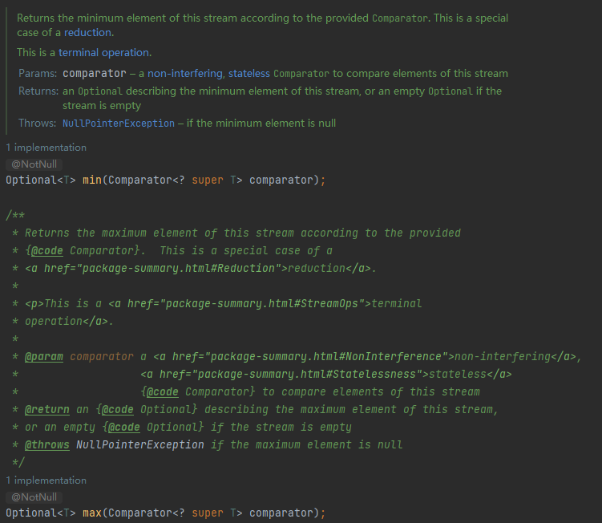

# JDK

JDK源码分析相关案例

# JDK概念


## JVM

JVM全称Java Virtual
Mechinal，即Java虚拟机。JVM是驻留于内存中的抽象计算机，可以理解为一个虚拟的计算机，它是通过在真实计算机上仿真模拟各种计算机功能来实现的，具有处理器、堆栈、寄存器等完善的硬件架构以及响应的指令系统，通过抽象CPU和操作系统结构，使代码的执行与主机硬件、主机操作系统无关。

JVM关注的是Java字节码文件（类文件.class），Java字节码文件由JVM指令集、符号表以及一些补充信息组成。JVM的主要工作是将Java字节码解释为本地机器码，实际就是将自己的指令集（Java字节码）映射为本地CPU的指令集或操作系统的接口调用（本地机器码）

Java语言的跨平台性，其实就是靠不同平台版本的JVM来实现的。不同的操作系统，使用不同的JVM映射规则，使Java字节码的解释执行与操作系统无关，从而完成跨平台（一次编译，到处执行）。也就是说，能跨平台的是Java程序，而JVM是不能跨平台的，对于不同的操作系统平台有不同的JVM实现，Java程序的跨平台性就是通过JVM的不跨平台实现的。

### JVM包含的组件

- 类加载器： 将类文件.class加载到内存中
- 字节码验证工具： 检查代码中是否存在访问限制违规
- 执行引擎： 将字节码转换为可执行的机器码
- JIT： Just-In-Time,即时编译，用于提高JVM的性能，加快Java程序的执行速度

### JVM版本

JVM 除了跨平台意义上的不同实现之外，还有很多不同的发行版，每个发行版通常都会有不同平台的实现。这些不同的发行版往往会有不同的特性，或针对不同的领域。

- HotSpot VM:这是最主流的JVM实现，可以说是”标准JVM“，Oracle JDK 以及 OpenJDK的各种变种版本 如
  AdoptOpenJDK、Zulu、IcedTea等用的都是HotSpot VM
- OpenJ9 VM：OpenJ9最初由IBM开发，定位是企业级的开源JVM，2017年托管至Eclipse基金会并在GitHub上开源
- Zing VM：Azul在2010年发布的JVM，在HotSpot VM 基础上做了很多定制和优化工作

上述JVM主要是在JSE/JEE 领域的主流选择，而针对JME领域及Android或Android兼容系统也有诸如CLDC-HI、JavaCard、Sun
SPOT、OpenJ9（OpenJ9是一个高度模块化的JVM，在嵌入式、JME领域都可以应对）等实现。此外还有一些研究性质的JVM，如Graal VM、Jikes
RVM、Maxine VM等

## JRE

JRE全称 Java Runtime Environment，即Java运行时环境，由运行和管理Java应用程序的类库和工具组成

JRE中包含了JVM，单纯的JVM不能运行Java程序，JVM在解释Java字节码时需要用到一些核心类库，这些核心类库就被包含在JRE中，简单来说JRE就是JVM+核心类库

除了JVM和核心类库之外，通常的JRE发行版中还会包含一些其他的工具和命令，如密钥库工具keytool、安全策略管理工具policytool、jar文件他所工具pack200/unpack200

## JDK

JDK 全称 Java Development Kit，即Java开发工具包，是面向Java开发人员使用的SDK（Software Development
Kit，软件开发工具包），提供了Java程序的开发环境和运行环境

JDK包含了JRE、基础类库（Java
API，如网络、IO、线程、图形等）、Java源码编译器javac、以及其他的一系列用于开发、诊断、分析、调试、管理的工具和命令，如jar、javah、native2ascii、jdb、jconsole、jstat、jps、jmap、jhat等

> 从 Java 11 开始，安装 JDK 时不会直接安装 JRE，需要用户自行选择安装 JRE 模块，可以使用 `jlink`
> 程序生成，如：`bin\jlink.exe --module-path jmods --add-modules java.desktop --output jre` 。

JDK 有多个构建版本，而实际只有一组源代码，即 OpenJDK，使用分布式版本控制系统 Mercurial
托管在 [OpenJDK](https://link.zhihu.com/?target=http%3A//openjdk.java.net/projects/jdk/)
。任何人都可以获取这些源码，并用其构建一个变种版本进行发布。当然需要一个独有的认证程序来确保构建的变种版本是有效的，这个认证程序是由 [JCP（Java Community Process）](https://link.zhihu.com/?target=https%3A//www.jcp.org/en/home/index)
组织审核的，该组织会提供一套技术兼容性工具包 TCK（Technology Conformance Kit）。如果你构建了一个 OpenJDK 的变种版本，并通过了
TCK 的兼容性测试，则可以将该变种版本称为“Java SE
Compatible”（兼容 Java SE 的 JDK）。

### OpenJDK主流版本

- **[Oracle JDK](https://link.zhihu.com/?target=https%3A//www.oracle.com/technetwork/java/javase/downloads/index.html)**
  ：就是之前的 Sun JDK，被 Oracle 收购后命名为 Oracle JDK，由 Oracle 的团队维护。从 Java 11
  开始提供付费的商业支持，当然个人或非商业用途仍然可以享受免费支持。但现阶段还没有单独针对 Oracle
  JDK 的付费策略，基本是和 Oracle 的其它商业产品绑定，Oracle 计划在 2026 年后提供全额付费的服务支持。
- **[Oracle OpenJDK](https://link.zhihu.com/?target=http%3A//openjdk.java.net/)**：免费的 OpenJDK 版本，基于 GPL
  协议开源，允许直接用于商业环境。Oracle 提交的源代码衍生出 Oracle JDK 和 Oracle OpenJDK 不同的编译版本，从 Java 11
  开始，两者的特性差异已经最小化，差异部分大多是 Oracle 的商业特性。但
  Oracle OpenJDK 大版本发布后，Oracle 对其最多会有两次安全补丁的升级（发布后的六个月内），之后不再负责该大版本维护，如果用户想持续获得安全升级，需要及时更新到新的大版本。由于
  Oracle OpenJDK
  是开源的，因此可以直接基于源码编译出社区版 JDK，甚至可以加入自定义特性并商业化。*值得一提的是，在安全补丁级别相同的情况下，Oracle
  JDK 并不比 OpenJDK 更好。如果不需要商业支持或企业管理工具，可以选择使用
  Oracle OpenJDK 构建版本。*
- **[AdoptOpenJDK](https://link.zhihu.com/?target=https%3A//adoptopenjdk.net/%3FjvmVariant%3Dhotspot)**：一个由社区驱动的项目，基于
  GPL 开源协议，以免费软件的形式提供社区版 OpenJDK 二进制包，与 Oracle OpenJDK 不同的是，该发行版会长期提供安全及其它补丁的更新，和
  Java 11 一样，至少提供 4 年的免费长期支持（LTS）计划。IBM
  和 Red Hat 也曾表示提供相关安全补丁。
- **[AdoptOpenJDK OpenJ9](https://link.zhihu.com/?target=https%3A//adoptopenjdk.net/%3FjvmVariant%3Dopenj9)**：除了标准的
  OpenJDK 构建外，AdoptOpenJDK 还提供了使用 OpenJ9 VM 的版本。OpenJ9 是最初由 IBM 实现的
  JVM，现在由 [Eclipse 基金会](https://link.zhihu.com/?target=https%3A//www.eclipse.org/openj9/)
  运作，并在 [GitHub](https://link.zhihu.com/?target=https%3A//github.com/eclipse/openj9) 上开源。
- **[Red Hat OpenJDK](https://link.zhihu.com/?target=https%3A//developers.redhat.com/products/openjdk/download)**：这是
  Red
  Hat 提供的一个 OpenJDK 构建版本，提供商业付费支持，它通常被集成在 Red Hat 的操作系统中（RHEL, Red Hat Enterprise Linux）。
- **[Azul Zulu](https://link.zhihu.com/?target=https%3A//www.azul.com/downloads/zulu-community/)**：一个 OpenJDK
  的免费版本，同时也提供商业付费支持。
- **[IBM JDK](https://link.zhihu.com/?target=https%3A//developer.ibm.com/javasdk/downloads/)**：IBM 为 Java 8
  及更早版本提供支持，另外
  IBM 还为 AdoptOpenJDK OpenJ9 版本提供商业付费支持。

除了上面所述之外，还有其它很多不同的构建版本，如阿里巴巴的 [Dragonwell](https://link.zhihu.com/?target=https%3A//github.com/alibaba/dragonwell8)
，AWS
的 [Corretto](https://link.zhihu.com/?target=https%3A//aws.amazon.com/cn/corretto/) 等，此外不同的 Linux 发行版也会使用不同的方式内置
OpenJDK，如 [Ubuntu](https://link.zhihu.com/?target=https%3A//help.ubuntu.com/community/Java)
、[Debian](https://link.zhihu.com/?target=https%3A//wiki.debian.org/Java%23Java_and_Debian)
、[Fedora](https://link.zhihu.com/?target=https%3A//fedoraproject.org/wiki/Java%23Java_packages_in_Fedora)
、[Arch](https://link.zhihu.com/?target=https%3A//wiki.archlinux.org/index.php/java%23Officially_supported_packages)
等，而如果要追求“标准”，最好的建议是使用 Oracle OpenJDK、AdoptOpenJDk 以及 Linux 发行版中内置的构建版本。

# 集合类


## Iterable

```java
/*
 * Copyright (c) 2003, 2013, Oracle and/or its affiliates. All rights reserved.
 * ORACLE PROPRIETARY/CONFIDENTIAL. Use is subject to license terms.
 */
package java.lang;

import java.util.Iterator;
import java.util.Objects;
import java.util.Spliterator;
import java.util.Spliterators;
import java.util.function.Consumer;

/**
 * 实现此接口允许对象成为“for-each 循环”语句的目标,请参阅 For-each 循环
 */
public interface Iterable<T> {
    /**
     * 返回 T 类型元素的迭代器
     *
     * @return an Iterator.
     */
    Iterator<T> iterator();

    /**
     * 对 Iterable 的每个元素执行给定的操作，直到处理完所有元素或该操作引发异常。除非实现类另有规定，否则按迭代顺序执行操作（如果指定了迭代顺序）.
     * 操作引发的异常将转发给调用者。
     *
     * @implSpec
     * <p>The default implementation behaves as if:
     * <pre>{@code
     *     for (T t : this)
     *         action.accept(t);
     * }</pre>
     *
     * @param action 为每个元素执行的操作
     * @throws NullPointerException – 如果指定的操作为空
     * @since 1.8
     */
    default void forEach(Consumer<? super T> action) {
        Objects.requireNonNull(action);
        for (T t : this) {
            action.accept(t);
        }
    }

    /**
     * 在此 Iterable 描述的元素上创建 Spliterator。
     *
     * @implSpec
     * 要求：默认实现从可迭代的迭代器创建一个早期绑定拆分器。 spliterator 继承了 iterable 的 iterator 的 fail-fast 属性。
     *
     * @implNote
     * 默认实现通常应该被覆盖。默认实现返回的拆分器的拆分能力很差，没有大小，并且不报告任何拆分器特征。实现类几乎总能提供更好的实现。
     *
     * @return 在此 Iterable 描述的元素上的 Spliterator。
     * @since 1.8
     */
    default Spliterator<T> spliterator() {
        return Spliterators.spliteratorUnknownSize(iterator(), 0);
    }
}

```

### Iterator


- hashNext() 返回true 如果迭代具有更多的元素
- next() 返回迭代中的下一个元素
- remove() 从基础集合中移除这个迭代器返回的最后一个元素
- forEachRemaining(Consumer<? super E>) 执行给定的每个剩余元素的动作，直到所有的元素都被处理或操作抛出异常

迭代器绑定后对数据集合的修改会报ConcurrentModificationException异常。

```java
package com.hollyland.Iterator;

import java.util.ArrayList;
import java.util.Iterator;
import java.util.List;

/**
 * @ClassName IteratorTest
 * @Description TODO
 * @Author wangqiang
 * @Date 2022/9/7 10:04
 **/
public class IteratorTest {
    public static void main(String[] args) {
        List<String> fruit = new ArrayList<>();
        fruit.add("apple");
        fruit.add("banana");
        fruit.add("strawberry");
        fruit.add("cherryBomb");
        fruit.add("watermelon");
        System.out.println("当前的list= " + fruit);
        Iterator<String> iterator = fruit.iterator();
        System.out.println("传统的迭代器");
        while (iterator.hasNext()) {
            String str = iterator.next();
            System.out.println(str + " ");
            if (str.equals("apple")) {
                iterator.remove();
            }
        }
        System.out.println();

        System.out.println("使用Iterator的forEachRemaining方法第一次");
        iterator.forEachRemaining(System.out::println);
        System.out.println();

        System.out.println("使用Iterator的forEachRemaining方法第二次");
        iterator.forEachRemaining(System.out::println);
        System.out.println();

        System.out.println("直接使用顶级接口forEach方法");
        fruit.forEach(System.out::println);
    }
}

```

### Spliterator


#### 嵌套类摘要

- Spliterator.OfPrimitive 专用于原始值的Spliterator
- Spliterator.OfInt 专用于Int值的Spliterator
- Spliterator.OfLong 专用于Long值的Spliterator
- Spliterator.OfDouble 专用于Double值的Spliterator

#### 方法摘要

- tryAdvance(Consumer<? super T> action):boolean
    - 如果剩余元素存在，执行特定的动作的话，返回true；否则返回false
- forEachRemaining(Consumer <? super T> action):void
    - 对每个剩余元素执行给定的操作，在当前线程中顺序执行，直到所有的元素都被处理或操作抛出异常。
- trySplit():Spliterator
    - 如果这spliterator可以分割，返回一个spliterator覆盖的元素，将这一方法，在回归，不是这个spliterator覆盖。
    - 分割迭代器，每调用一次，将原来的迭代器等分为两份，并返回索引靠前的那一个子迭代器。
- estimateSize():long
    - 返回的元素，返回 forEachRemaining 遍历将遇到的元素数量的估计值，如果无限、未知或计算过于昂贵，则返回 Long.MAX_VALUE。
- getExactSizeIfKnown():long
    - 如果此 Spliterator 为 SIZED，则返回 estimateSize() 的便捷方法，否则返回 -1。
- characteristics():int
    - 返回此 Spliterator 及其元素的一组特征。结果表示为
      ORDERED、DISTINCT、SORTED、SIZED、NONNULL、IMMUTABLE、CONCURRENT、SUBSIZED 的 ORed
      值。在给定拆分器上重复调用特性（），在调用 trySplit 之前或之间，应该总是返回相同的结果
- hasCharacteristics():boolean
    - 如果此 Spliterator 的特征包含所有给定特征，则返回 true。
- getComparator():Comparator
    - 如果此 Spliterator 的源由 Comparator 排序，则返回该 Comparator。如果源按自然顺序排序，则返回 null。否则，如果源未排序，则抛出
      IllegalStateException。

#### 字段摘要

- ORDERED 迭代器按照原始顺序迭代元素
- DISTINCT 迭代器中的元素是没有重复的
- SORTED 迭代器是按照某种方式排序的顺序迭代器
- SIZED 迭代器迭代元素的个数是有界的
- NONNULL 迭代器迭代的元素值不为null
- IMMUTABLE 迭代器迭代的元素是不能改变的
- CONCURRENT 迭代器的数据源是线程安全的
- SUBSIZED 迭代器所有的子迭代器（直接的或者间接的），有序的

以实现类为例


```java
 @Override
public Spliterator<E> spliterator(){
        return new ArrayListSpliterator<>(this,0,-1,0);
        }

/** Index-based split-by-two, lazily initialized Spliterator */
static final class ArrayListSpliterator<E> implements Spliterator<E> {

    private final ArrayList<E> list;
    private int index; // current index, modified on advance/split
    private int fence; // -1 until used; then one past last index
    private int expectedModCount; // initialized when fence set

    /** Create new spliterator covering the given  range */
    ArrayListSpliterator(ArrayList<E> list, int origin, int fence,
                         int expectedModCount) {
        this.list = list; // OK if null unless traversed
        this.index = origin;
        this.fence = fence;
        this.expectedModCount = expectedModCount;
    }

```

- list 数据集合
- index 起始位置 ，会被advance和split函数修改
- fence 代表当前结束位置的最后一个小标，-1表示第一次使用，然后指最后一个索引
- expectedModCount 设置围栏时初始化
  expectedModCount存放了当该迭代器所对应的ArrayList的modCount来保证迭代器在迭代数据中原本数组中的数据并没有发生变化,该变量会被fence更改。

estimateSize()，用来估算将要迭代的元素的数量。characteristics()返回特征值。

```java
        private int getFence(){ // initialize fence to size on first use
        int hi; // (a specialized variant appears in method forEach)
        ArrayList<E> lst;
        if((hi=fence)< 0){
        if((lst=list)==null)
        hi=fence=0;
        else{
        expectedModCount=lst.modCount;
        hi=fence=lst.size;
        }
        }
        return hi;
        }

public ArrayListSpliterator<E> trySplit(){
        int hi=getFence(),lo=index,mid=(lo+hi)>>>1;
        return(lo>=mid)?null: // divide range in half unless too small
        new ArrayListSpliterator<E>(list,lo,index=mid,
        expectedModCount);
        }
```

getFence()，会确定当前的迭代器的最后分隔下标，如果是-1，则代表此次是第一次使用，更新当前迭代器的expectedModCount为对应容器的modCount，同时更新fence为对应容器的size。

trySplit()每次分割，都将原来的迭代器等分为两个，并返回索引靠前的那个,除非实在太小，正常是二分。

```java
        public boolean tryAdvance(Consumer<? super E>action){
        if(action==null)
        throw new NullPointerException();
        int hi=getFence(),i=index;
        if(i<hi){
        index=i+1;
@SuppressWarnings("unchecked") E e=(E)list.elementData[i];
        action.accept(e);
        if(list.modCount!=expectedModCount)
        throw new ConcurrentModificationException();
        return true;
        }
        return false;
        }

public void forEachRemaining(Consumer<? super E>action){
        int i,hi,mc; // hoist accesses and checks from loop
        ArrayList<E> lst;Object[]a;
        if(action==null)
        throw new NullPointerException();
        if((lst=list)!=null&&(a=lst.elementData)!=null){
        if((hi=fence)< 0){
        mc=lst.modCount;
        hi=lst.size;
        }
        else
        mc=expectedModCount;
        if((i=index)>=0&&(index=hi)<=a.length){
        for(;i<hi; ++i){
@SuppressWarnings("unchecked") E e=(E)a[i];
        action.accept(e);
        }
        if(lst.modCount==mc)
        return;
        }
        }
        throw new ConcurrentModificationException();
        }
```

tryAdvance()数组的ModCount进行验证。

forEachRemaining()，这里是一次性对所有数据进行操作。

### ListIterator

Iterator只为我们提供remove方法，如果要添加元素，可以使用ListIterator，它继承了Iterator，提供add与set操作。ListIterator是List的特有迭代器


```java
package com.hollyland.Iterator;

import java.util.ArrayList;
import java.util.List;
import java.util.ListIterator;

/**
 * @ClassName ListIteratorTest
 * @Description TODO
 * @Author wangqiang
 * @Date 2022/9/7 13:47
 **/
public class ListIteratorTest {
    public static void main(String[] args) {
        List<String> fruit = new ArrayList<>();
        fruit.add("apple");
        fruit.add("banana");
        fruit.add("strawberry");
        fruit.add("cherryBomb");
        fruit.add("watermelon");
        System.out.println("原始 ：" + fruit);

        ListIterator<String> stringListIterator = fruit.listIterator();
        while (stringListIterator.hasNext()) {
            if ("watermelon".equals(stringListIterator.next())) {
                stringListIterator.set("pear");
                stringListIterator.add("peach");
            }
        }

        System.out.println("处理后:" + fruit);
    }
}
```


## Collection


- 添加
    - add(E):boolean 添加对象到集合
    - addAll(Collection< ? extends E>):boolean 将指定集合中的所有元素添加到这个集合（可选操作）。
- 删除
    - clear():void 从这个集合中移除所有的元素（可选操作）。
    - remove(Object):boolean 从这个集合中移除指定元素的一个实例，如果它是存在的（可选操作）。
    - removeAll(Collection<?>) 删除此集合中包含的所有元素（可选操作）的所有元素（可选操作）。
    - retainAll(Collection<?>) 仅保留包含在指定集合中的这个集合中的元素（可选操作）。
    - removeIf(Predicate<? super E>):boolean 删除满足给定谓词的这个集合的所有元素。
- 判断
    - isEmpty():boolean 返回true如果集合不包含任何元素。
    - contais(Object):boolean 返回true如果集合包含指定元素。
    - containsAll(Collection<?>):boolean 返回true如果这个集合包含指定集合的所有元素。
- 获取数量
    - size():int 返回此集合中的元素的数目。
- 获取集合元素
    - interator():Iterator 返回此集合中的元素的迭代器。
    - spliterator():Spliterator 创建此集合中的元素的Spliterator
- 标识
    - hashCode():int 返回此集合的哈希代码值。
    - equals():boolean 将指定的对象与此集合进行比较，以进行相等性。
- 将集合变成数组
    - toArray():Object[] 返回包含此集合中所有元素的数组。
    - toArray(T[]):T[] 返回包含此集合中所有元素的数组；返回数组的运行时类型是指定的数组的运行时类型。
- Stream流
    - stream():Stream<E>  返回一个序列Stream与集合的来源。
    - parallelStream():Stream<E> 返回一个可以并行Stream与集合的来源。它通过默认的ForkJoinPool,可能提高你的多线程任务的速度。

### List

list直接继承Collection


List集合是线性数据结构的主要实现，集合元素通常存在明确的上一个元素或下一个元素，也存在明确的第一个元素和最后一个元素。List集合的遍历结果是稳定的

### Set

Set直接继承Collection


Set不允许出现重复元素的集合类型。常用的如HashSet、TreeSet、LinkedHashSet。

### Queue

Queue直接继承Collection


Queue队列是一种先进先出的数据结构，是一种特殊的线性表，它只允许在表的一端进行获取，在表的另一端进行插入。没有元素时为空队列。


### parallelStream

parallelStream其实就是一个并行执行的流，它通过默认的ForkJoinPool，可能提高多线程任务的速度

#### parallelStream的作用

Stream具有平行处理能力，处理的过程会分而治之，也就是将一个大任务切分成多个小任务，这表示每个任务都是一个操作,因此像以下的程式片段：

```java
List<Integer> numbers=Arrays.asList(1,2,3,4,5,6,7,8,9);
        numbers.parallelStream()
        .forEach(out::println);
```

得到展示顺序不一定是1、2、3、4、5、6、7、8、9，而可能是任意的顺序，就forEach()
这个操作来讲，如果平行处理时，希望最后顺序是按照原来Stream的数据顺序，那可以调用forEachOrdered().

```java
List<Integer> numbers=Arrays.asList(1,2,3,4,5,6,7,8,9);
        numbers.parallelStream()
        .forEachOrdered(out::println);
```

> 注意：如果forEachOrdered()中间有其他如filter()的中介操作，会试着平行化处理，然后最终forEachOrdered()
> 会以原数据顺序处理，因此，使用forEachOrdered()
> 这类的有序处理，可能会（或完全失去）时区平行化的一些优势，实际上中介操作亦有可能如此，例如sorted()方法。

#### parallelStream背后的实现：ForkJoinPool

ForkJoin框架是从JDK7中新特性，它同ThreadPoolExecutor一样，也实现了Executor和ExecutorService接口。它使用了一个无限队列来保存需要执行的任务，而线程的数量则是通过构造函数传入，如果没有向构造函数中传入希望的线程数量，那么当前计算机可用的CPU数量会被设置为线程数量作为默认值

ForkjoinPool主要用来使用分治法（Divide-and-Conquer Algorithm)
来解决问题。典型的应用比如快速排序算法。这里的要点在于，ForkJoinPool需要使用相对少的线程来处理大量的任务。比如要对1000万个数据进行排序，那么会将这个任务分割成两个500万的排序任务和一个针对这两组500万数据的合并任务。以此类推，对于500万的数据也会做出同样的分割处理，到最后会设置一个阈值来规定当数据规模到多少时，停止这样的分割处理。比如，当元素的数量小于10时，会停止分割，转而使用插入排序对它们进行排序。那么到最后，所有的任务加起来会有大概2000000+个。问题的关键在于，对于一个任务而言，只有当它所有的子任务完成之后，它才能够被执行。

所以当使用ThreadPoolExecutor时，使用分治法会存在问题，因为ThreadPoolExecutor中的线程无法像任务队列中再添加一个任务并且在等待该任务完成之后再继续执行。而使用ForkJoin时，就能够让其中的线程创建新的任务，并挂起当前的任务，此时线程就能够从队列中选择子任务执行

#### 使用ThreadPoolExecutor或者ForkJoinPool，会有什么性能差异

首先，使用ForkJoinPool能够使用数量有限的线程来完成非常多的具有父子关系的任务，比如使用4个线程来完成超过200万个任务。但是，使用ThreadPoolExecutor时，是不可能完成的，因为ThreadPoolExecutor中的Thread无法选择优先执行子任务，需要完成200万个具有父子关系的任务时，也需要200万个线程，显然这是不可行的

#### 工作窃取算法

forkjoin最核心的地方就是利用了现代硬件设备多核，在一个操作时候会有空闲的cpu，那么如何利用好这个空闲的cpu就成了提高性能的关键，而这里工作窃取（work-stealing）算法就是整个forkjoin框架的核心理念，工作窃取算法是指某个线程从其他队列里窃取任务来执行

#### 为什么需要使用工作窃取算法

假如我们需要做一个比较大的任务，我们可以把这个任务分割成若干互不依赖的子任务，为了减少线程间的竞争，于是把这些子任务分别放到不同的队列里，并为每个队列创建一个单独的线程来执行队列里的任务，线程和队列一一对应，比如A线程负责处理A队列里的任务。但是有的线程会先把自己队列里的任务干完，而其他线程对应的队列里还有任务等待处理。干完活的线程与其等着，不如去帮其他线程干活，于是它就去其他线程的队列里窃取一个任务来执行。而再这时它们会访问同一个队列，所以为了减少窃取任务线程和被窃取任务线程之间的竞争，通常会使用双端队列，被窃取任务线程永远从双端队列的头部拿任务执行，而窃取任务的线程永远从双端队列的尾部那任务执行

> 工作窃取算法的有点是充分利用线程进行并行计算，并减少了线程间的竞争，其缺点是在某些情况下还是存在竞争，比如双端队列里只有一个任务时。并且小号了更多的系统资源，比如创建多个线程和多个双端队列

#### 用forkjoin的眼光来看ParallelStreams

上下文提到了在Java8引入了自动并行化的概念。它能让一部分Java代码自动地以并行地方式执行，也就是我们使用了ForkjoinPool地ParallelStream

Java8为ForkjoinPool添加了一个通用线程池，这个线程池用来处理那些没有被显式提交到热河线程池的任务。它是ForkjoinPool类型上的一个静态元素，它拥有的默认线程数量等于运行计算机上的处理器数量。当调用Arrays类上添加的新方法时，自动并行化就会发生。比如用来排序一个数组的并行快速排序，用来对一个数组中的元素进行并行遍历。自动化并行也被运用在Java8新添加的Stream
API中。

比如下面的代码用来遍历列表中的元素并执行需要的操作

```java
List<UserInfo> userInfoList=DaoContainers.getUserInfoDAO().queryAllByList(new UserInfoModel());
        userInfoList.parallelStream().forEach(RedisUserApi::setUserIdUserInfo);
```

对于列表中的元素的操作都会以并行的方式执行。forEach方法会为每个元素的计算操作创建一个任务，该任务会被前文中提到的ForkJoinPool中的通用线程池处理。以上的并行计算逻辑当然也可以使用ThreadPoolExecutor完成，但是就代码的可读性和代码量而言，使用ForkJoinPool明显更胜一筹

对于ForkjoinPool通用线程池的线程数量，通常使用默认值就可以了，即运行时计算机的处理器数量。我们这里提供了一个示例的代码让你了解JVM所使用的ForkjoinPool
的线程数量，可以通过设置系统属性:

-Djava.util.concurrent.ForkjoinPool.common.parallelism=N(N为线程数量)，来调整ForkjoinPool的线程数量，可以尝试调整成不同的参数来观察每次的输出结果

```java
package com.hollyland.stream.parallelStream;

import java.util.ArrayList;
import java.util.List;
import java.util.Set;
import java.util.concurrent.CopyOnWriteArraySet;
import java.util.concurrent.CountDownLatch;

/**
 * @ClassName parallelStreamTest
 * @Description 这是一个用来让你更加熟悉parallelStream的原理的实例
 * @Author wangqiang
 * @Date 2022/9/15 10:03
 **/
public class parallelStreamTest {
    public static void main(String[] args) throws InterruptedException {
        System.out.println("Hello world");
        // 构造一个10000个元素的集合
        List<Integer> list = new ArrayList<>();
        for (int i = 0; i < 10000; i++) {
            list.add(i);
        }
        // 统计并行执行list的线程
        Set<Thread> threadSet = new CopyOnWriteArraySet<>();
        // 并行执行
        list.parallelStream().forEach(integer -> {
            Thread thread = Thread.currentThread();
            // System.out.println(thread);
            // 统计并行执行List的线程
            threadSet.add(thread);
        });
        System.out.println("threadSet一共有 " + threadSet.size() + " 个线程");
        System.out.println("系统一共有 " + Runtime.getRuntime().availableProcessors() + " 个CPU");
        List<Integer> list1 = new ArrayList<>();
        List<Integer> list2 = new ArrayList<>();
        for (int i = 0; i < 10000; i++) {
            list1.add(i);
            list2.add(i);
        }
        Set<Thread> threadSetTwo = new CopyOnWriteArraySet<>();
        CountDownLatch countDownLatch = new CountDownLatch(2);
        Thread threadA = new Thread(() -> {
            list1.parallelStream().forEach(integer -> {
                Thread thread = Thread.currentThread();
                // System.out.println("list1 " + thread);
                threadSetTwo.add(thread);
            });
            countDownLatch.countDown();
        });
        Thread threadB = new Thread(() -> {
            list2.parallelStream().forEach(integer -> {
                Thread thread = Thread.currentThread();
                // System.out.println("list2 " + thread);
                threadSetTwo.add(thread);
            });
            countDownLatch.countDown();
        });
        threadA.start();
        threadB.start();
        countDownLatch.await();
        System.out.println("threadSetTwo一共有 " + threadSetTwo.size() + " 个线程");

        System.out.println("------------------------------------");
        System.out.println(threadSet);
        System.out.println(threadSetTwo);
        System.out.println("------------------------------------");
        threadSetTwo.addAll(threadSet);
        System.out.println(threadSetTwo);
        System.out.println("threadSetTwo一共有 " + threadSetTwo.size() + " 个线程");
        System.out.println("系统一共有 " + Runtime.getRuntime().availableProcessors() + " 个CPU");
    }
}
```


出现这种现象的原因是，forEach用了一些小把戏。它会将执行forEach本身的线程也作为线程池中的一个工作线程。因此，即使将ForkjoinPool的通用线程池的线程数量设置为1，实际上也会有2个工作线程。因此在使用forEach的时候，线程数为1的ForkjoinPool通用线程池和线程数为2的ThreadPoolExecutor是等价的。

所以当ForkjoinPool通用线程池实际需要4个工作线程时，可以将它设置成3，那么在运行时可用的工作线程就是4了

> 小结：
>
> 1. 当需要处理递归分治算法时，考虑使用ForkjoinPool
> 2. 仔细设置不再进行任务划分的阈值，这个阈值对性能有影响
> 3. Java 8 中的一些特性会使用到ForkjoinPool中的通用线程池。在某些场合下，需要调整该线程池的默认的线程数量

#### ParallelStreams的陷阱

parallelStream的程序都有可能称为阻塞程序的源头，并且在执行过程中的其他部分将无法访问这些workers，这意味着任何依赖parallelStream的程序在别的东西占用着common
ForkjoinPool时将会变得不可预知并且暗藏危机

#### 如何正确的使用ParallelStream

一种方式是限制ForkjoinPool提供的并行数。可以通过-Djava.util.concurrent.ForkJoinPool.common.parallelism=1
来限制线程池的大小为1.不再从并行化中得到好处可以杜绝错误的使用（但是这个方法有问题，毕竟这样还不如不去使用并行流）

另一种方式就是，一个被称为工作区的可以让ForkJoinPool平行放置的parallelStream()实现。但是JDK还没有实现

Parallel stream
是无法预测的，而且想要正确地使用它有些棘手。几乎任何parallelstream的使用都会影响程序中无关部分的性能，而且是一种无法预测的方式。但是再调成stream.parallel()
或者parallelStream()时候在我的代码里之前我仍然会重新审视一遍他给我的程序究竟会带来什么样的问题，他能有多大的提升，是否有使用他的意义

#### stream or parallelStream

上文我们看到了parallelStream所带来的隐患和好处，那么，在从stream和parallelStream方法中进行选择时，我们可以考虑以下几个问题

1. 是否需要并行
2. 任务之间是否是独立的？是否会引起任何竞态条件
3. 结果是否取决于任务的调用顺序

对于问题1，在回答这个问题之前，你需要弄清楚你要解决的问题是什么，数据量有多大，计算的特点是什么？并不是所有的问题都适合使用并发程序来求解，比如当数据量不大时，顺序执行往往比并行执行更快，毕竟，准备线程池和其他相关资源也是需要时间的。但是，当任务涉及到IO操作并且任务之间不互相依赖时，那么并行化就是一个不错的选择。通常而言，将这类程序并行化之后，执行速度会提升好几个等级

对于问题2，如果任务之间是相互独立的，并且代码中不涉及到对同一个对象的某个状态或者某个变量的更新操作，那么就表明代码是可以被并行化的

对于问题3，由于在并行环境中任务的执行顺序是不确定的，因此对于依赖于顺序的任务而言，并行化也许不能给出正确的答案

## Stream流

JDK8 为 Collection新添加了Stream流，跟我们以往的IO流或者XML处理中的流没有任何关系，是一个全新针对几何数据进行便捷高效的聚合操作与大批量数据处理操作

### 什么是流

Stream不是集合元素，它不是数据结构并不保存数据，它是有关算法和计算的，它更像一个高级版本的Iterator。原始版本的Iterator，用户只能显式地一个一个遍历元素并对其执行某些操作；高级版本的Stream，用户只要给出需要对其包含的元素执行什么操作，比如“过滤掉长度大于10的字符串”、“获取每个字符串的首字母”等，Stream会隐式地在内部进行遍历，做出相应的数据转换。Stream就如同一个迭代器（Iterator），单项，不可往复，数据只能遍历一次，遍历一次后即用尽了，就好像流水从面前流过，一去不复返。Stream的另外一大特点是，数据源本身可以是无限的

简单说，对Stream的使用就是实现一个filter-map-reduce过程，产生一个最终结果，或者导致一个副作用（side effect）

### 如何创建一个Stream流

集合接口有两个方法

- stream() - 为集合创建串行流
- parallelStream() - 为集合创建并行流

数组也可以创建,或者直接创建Stream类

```java
package com.hollyland.stream;

import java.util.Arrays;
import java.util.List;
import java.util.stream.Stream;

/**
 * @ClassName CreateStreamTest
 * @Description TODO
 * @Author wangqiang
 * @Date 2022/9/7 15:40
 **/
public class CreateStreamTest {
    public static void main(String[] args) {
        // 1.直接创建
        Stream<String> stream = Stream.of("a", "b", "c");
        // 2.数组创建Stream
        String[] strArray = {"a", "b", "c"};
        stream = Stream.of(strArray);
        stream = Arrays.stream(strArray);
        // 3.集合类方法创建
        List<String> list = Arrays.asList(strArray);
        stream = list.stream();
    }
}

```

Stream虽然支持Stream<Integer>、Stream<Long> 、Stream<Double>
这样创建基本数据类型包装类，但是会在拆箱装箱耗费时间，所以Stream还提供了IntStream、LongStream、DoubleStream这三种常用的Stream包装类，其他的数据类型暂时还不支持。

### 如何对流进行操作

当我们将集合或者容器包装成Stream流时，我们就可以开始操作它了，流的操作类型分为两种

1. Intermediate：中间操作都会返回流对象本身。这样多个操作可以串联成一个管道，如同流式风格（fluent
   style）。这样做可以对操作进行优化，这类操作都是惰性化的（lazy），就是说，仅仅带哦用到这类方法，并没有真正开始流的遍历
2. Terminal：
   一个流只能有一个terminal操作，当这个操作执行后，流就被使用“光”了，无法再被操作，一去不复返。所以这必定是流的最后一个操作。Terminal操作的执行，才会真正开始流的遍历，并且会生成一个结果，或者一个side
   effect

### 流常用的操作

#### Collectors

Collectors类实现了很多归纳操作，流转换为其他数据结构，例如将流转换成集合和聚合元素。这是一个Terminal操作

```java
package com.hollyland.stream.collectors;

import java.util.ArrayList;
import java.util.List;
import java.util.Set;
import java.util.Stack;
import java.util.stream.Collectors;
import java.util.stream.Stream;

/**
 * @ClassName CollectorsTest
 * @Description TODO
 * @Author wangqiang
 * @Date 2022/9/7 15:56
 **/
public class CollectorsTest {
    public static void main(String[] args) {
        // 1. Array
        Stream<String> stream1 = Stream.of("a", "b", "c");
        String[] strArray = stream1.toArray(String[]::new);
        // 2. Collection
        Stream<String> stream2 = Stream.of("a", "b", "c");
        List<String> list = stream2.collect(Collectors.toList());

        Stream<String> stream3 = Stream.of("a", "b", "c");
        ArrayList<String> list2 = stream3.collect(Collectors.toCollection(ArrayList::new));

        Stream<String> stream4 = Stream.of("a", "b", "c");
        Set<String> set = stream4.collect(Collectors.toSet());

        Stream<String> stream5 = Stream.of("a", "b", "c");
        Stack<String> stack1 = stream4.collect(Collectors.toCollection(Stack::new));

        // 3. String(joining标识合并字符串）
        Stream<String> stream6 = Stream.of("a", "b", "c");
        String str = stream6.collect(Collectors.joining()).toString();
    }
}
```

### map

map 方法用于映射每个元素到对应的结果,它的作用就是把 input Stream 的每一个元素，映射成 output Stream 的另外一个元素。

```java
package com.hollyland.stream.map;

import java.util.Arrays;
import java.util.List;
import java.util.stream.Collectors;

/**
 * @ClassName StreamOperationTest
 * @Description TODO
 * @Author wangqiang
 * @Date 2022/9/7 16:49
 **/
public class StreamOperationTest {
    public static void main(String[] args) {
        String[] strArray = {"a", "b", "c"};
        List<String> worldList = Arrays.asList(strArray);
        // 转换大小写
        List<String> output = worldList.stream()
                .map(String::toUpperCase)
                .collect(Collectors.toList());

        System.out.println(output);
    }
}
```

### flatMap

flatMap把input Stream中的层级结构扁平化，就是将最底层元素抽出来放到一起，最终output的新Stream里面已经没有list了，都是直接的数字

```java
package com.hollyland.stream.flatMap;

import java.util.Arrays;
import java.util.Collection;
import java.util.List;
import java.util.stream.Collectors;
import java.util.stream.Stream;

/**
 * @ClassName StreamFlatMapTest
 * @Description TODO
 * @Author wangqiang
 * @Date 2022/9/7 18:21
 **/
public class StreamFlatMapTest {
    public static void main(String[] args) {
        Stream<List<Integer>> inputStream = Stream.of(
                Arrays.asList(1),
                Arrays.asList(2, 3),
                Arrays.asList(4, 5, 6)
        );
        List<Integer> outputStream = inputStream.
                flatMap(Collection::stream)
                .collect(Collectors.toList());
        System.out.println(outputStream);
    }
}
```

### filter

用于通过设置的条件过滤出元素

```java
package com.hollyland.stream.filter;

import java.util.Arrays;
import java.util.List;
import java.util.stream.Collectors;

/**
 * @ClassName FilterTest
 * @Description TODO
 * @Author wangqiang
 * @Date 2022/9/8 13:55
 **/
public class FilterTest {
    public static void main(String[] args) {
        List<String> strings = Arrays.asList("aa", "bb", "", "cc", "", "dd", "");
        // 过滤空白字符串
        List<String> notNullStrings = strings.stream()
                .filter(x -> !x.isEmpty())
                .collect(Collectors.toList());

        System.out.println(notNullStrings);
    }
}
```

### forEach

forEach方法接收一个Lamda表达式，然后在Stream的每一个元素上执行该表达式

```java
package com.hollyland.stream.forEach;

import java.util.ArrayList;
import java.util.List;

/**
 * @ClassName forEachTest
 * @Description TODO
 * @Author wangqiang
 * @Date 2022/9/8 14:01
 **/
public class forEachTest {
    public static void main(String[] args) {
        List<Fruit> fruitList = new ArrayList<>();
        Fruit fruit1 = new Fruit(1, "pear", "small", 11);
        Fruit fruit2 = new Fruit(2, "apple", "big", 11);
        Fruit fruit3 = new Fruit(3, "banana", "small", 11);
        Fruit fruit4 = new Fruit(4, "cherryBomb", "big", 11);
        Fruit fruit5 = new Fruit(5, "watermelon", "big", 11);
        fruitList.add(fruit1);
        fruitList.add(fruit2);
        fruitList.add(fruit3);
        fruitList.add(fruit4);
        fruitList.add(fruit5);
        // 获取type类型为big的水果名称并打印
        fruitList.stream()
                .filter(f -> "big".equals(f.getType()))
                .forEach(f -> System.out.println(f.getName()));
    }
}
```

forEach 是 terminal 操作，因此它执行后，Stream 的元素就一去不复返了，如果需要 intermediate 操作可以使用具有相似功能的 peek
。

### Peek

```java
package com.hollyland.stream.peek;

import com.hollyland.stream.forEach.Fruit;

import java.util.ArrayList;
import java.util.List;
import java.util.stream.Collectors;

/**
 * @ClassName PeekTest
 * @Description TODO
 * @Author wangqiang
 * @Date 2022/9/8 14:18
 **/
public class PeekTest {
    public static void main(String[] args) {
        List<Fruit> fruitList = new ArrayList<>();
        Fruit fruit1 = new Fruit(1, "pear", "small", 11);
        Fruit fruit2 = new Fruit(2, "apple", "big", 11);
        Fruit fruit3 = new Fruit(3, "banana", "small", 11);
        Fruit fruit4 = new Fruit(4, "cherryBomb", "big", 11);
        Fruit fruit5 = new Fruit(5, "watermelon", "big", 11);
        fruitList.add(fruit1);
        fruitList.add(fruit2);
        fruitList.add(fruit3);
        fruitList.add(fruit4);
        fruitList.add(fruit5);

        fruitList.stream()
                .filter(f -> "big".equals(f.getType()))
                .peek(fruit -> System.out.println(fruit.getName()))
                .peek(fruit -> {
                    String upperString = fruit.getName().toUpperCase();
                    fruit.setName(upperString);
                })
                .peek(fruit -> System.out.println(fruit.getName()))
                .collect(Collectors.toList());
    }
}
```

peek方法作为intermediate 操作可以被多次执行，注意如果缺少terminal 操作，那么前面的intermediate
操作都不会被执行，对比上述例子缺少最后一个collect操作时，将不会有任何水果被打印到控制台。

### reduce


这个方法的主要作用是把 Stream 元素组合起来。它提供一个起始值（种子），然后依照运算规则（BinaryOperator），和前面 Stream
的第一个、第二个、第 n 个元素组合。从这个意义上说，字符串拼接、数值的 sum、min、max、average 都是特殊的 reduce。例如 Stream 的
sum 就相当于：

Integer sum = integers.reduce(0, (a, b) -> a+b);

或

Integer sum = integers.reduce(0, Integer::sum);

### limit/skip

limit返回Stream的前面n个元素，skip则是扔掉前n个元素

```java
package com.hollyland.stream.limitAndSkip;

import com.hollyland.stream.forEach.Fruit;

import java.util.ArrayList;
import java.util.List;
import java.util.stream.Collectors;

/**
 * @ClassName LimitAndSkipTets
 * @Description TODO
 * @Author wangqiang
 * @Date 2022/9/8 14:48
 **/
public class LimitAndSkipTest {
    public static void main(String[] args) {
        List<Fruit> fruitList = new ArrayList<>();
        Fruit fruit1 = new Fruit(1, "pear", "small", 11);
        Fruit fruit2 = new Fruit(2, "apple", "big", 11);
        Fruit fruit3 = new Fruit(3, "banana", "small", 11);
        Fruit fruit4 = new Fruit(4, "cherryBomb", "big", 11);
        Fruit fruit5 = new Fruit(5, "watermelon", "big", 11);
        fruitList.add(fruit1);
        fruitList.add(fruit2);
        fruitList.add(fruit3);
        fruitList.add(fruit4);
        fruitList.add(fruit5);
        List<String> fruits = fruitList.stream()
                .map(Fruit::getName)
                .limit(3)
                .skip(1)
                .collect(Collectors.toList());
        System.out.println(fruits);
    }

}
```

### sorted

对Stream的排序通过sorted进行，它比数据的排序更强之处在于你可以根据需要首先对Stream进行各类map、filter、limit、skip甚至distinct来减少元素数量后，再排序，这能帮助程序明显缩短执行时间。

```java
package com.hollyland.stream.sorted;

import com.hollyland.stream.forEach.Fruit;

import java.util.ArrayList;
import java.util.List;
import java.util.stream.Collectors;

/**
 * @ClassName SortedTest
 * @Description TODO
 * @Author wangqiang
 * @Date 2022/9/8 14:57
 **/
public class SortedTest {
    public static void main(String[] args) {
        List<Fruit> fruitList = new ArrayList<>();
        Fruit fruit1 = new Fruit(5, "pear", "small", 11);
        Fruit fruit2 = new Fruit(4, "apple", "big", 11);
        Fruit fruit3 = new Fruit(3, "banana", "small", 11);
        Fruit fruit4 = new Fruit(2, "cherryBomb", "big", 11);
        Fruit fruit5 = new Fruit(1, "watermelon", "big", 11);
        fruitList.add(fruit1);
        fruitList.add(fruit2);
        fruitList.add(fruit3);
        fruitList.add(fruit4);
        fruitList.add(fruit5);

        List<String> fruits = fruitList.stream()
                .sorted((A, B) -> A.getId() > B.getId() ? 1 : -1)
                .map(fruit -> fruit.getId() + ":" + fruit.getName())
                .collect(Collectors.toList());
        System.out.println(fruits);
    }
}
```

### min/max/distinct

min和max的功能也可以通过对Stream元素先排序，再findFirst来实现，但前者的性能会更好，为O(n)，而sorted的成本是O(n logn)
。同时他们作为特殊的reduce方法被独立出来也是因为求最大最小是很常见的操作




### Match


- allMatch(Predicate<? super T> predicate):boolean 返回此流中的所有元素是否匹配所提供的谓词。
- anyMatch(Predicate<? super T> predicate):boolean 返回此流中的任一元素是否匹配所提供的谓词。
- noneMatch(Predicate<? super T> predicate):boolean 返回此流中没有一个元素匹配所提供的谓词。

它们都不是要遍历全部元素才返回结果，是短路的。例如allMatch只要一个元素不满足条件，就skip剩下的所有元素，返回false。

### 自定义流

两种方法

第一种通过实现Supplier接口，把Supplier实例传递给Stream.generate()生成的Stream，可以自己来控制流的生成

```java
package com.hollyland.stream.supplier;

import java.util.Random;
import java.util.function.Supplier;
import java.util.stream.IntStream;
import java.util.stream.Stream;

/**
 * @ClassName supplierTest
 * @Description TODO
 * @Author wangqiang
 * @Date 2022/9/9 10:05
 **/
public class supplierTest {
    public static void main(String[] args) {
        // 生成三个两位随机数
        Random seed = new Random();
        // Supplier<Integer> random = seed::nextInt;
        Supplier<Integer> random = () -> seed.nextInt() % 100;
        Stream.generate(random).limit(3).forEach(System.out::println);
        System.out.println();
        // 另一种方法直接使用IntStream
        IntStream.generate(() -> seed.nextInt() % 100)
                .limit(3).forEach(System.out::println);
    }
}
```

第二种是自己实现的Supplier

```java
class FruitSupplier implements Supplier<Fruit> {
    private int index = 0;
    private Random random = new Random();

    @Override
    public Fruit get() {
        return new Fruit("" + index++, "Fruit" + index, "big", random.nextInt(100))
    }
}
```

随机生成水果

```java
Stream.generate(new FruitSupplier()).
        limit(5)
        .forEach(f->System.out.println(f.getName()))
```


### groupingBy与partitioningBy

groupingBy归组类似于SQL中的group by

```java
ArrayList<Fruit> fruits=new ArrayList<>();
        Fruit fruitA2=new Fruit(2,"pear","small",11);
        Fruit fruitB2=new Fruit(1,"apple","big",15);
        Fruit fruitC2=new Fruit(3,"banana","small",4);
        Fruit fruitD2=new Fruit(4,"cherryBomb","big",10);
        Fruit fruitE2=new Fruit(5,"watermelon","big",22);
        fruits.add(fruitA2);
        fruits.add(fruitB2);
        fruits.add(fruitC2);
        fruits.add(fruitD2);
        fruits.add(fruitE2);

        Map<String, List<Fruit>>collect=fruits.stream()
        .collect(Collectors.groupingBy(Fruit::getType));

        Iterator<Map.Entry<String, List<Fruit>>>iterator=collect.entrySet().iterator();
        while(iterator.hasNext()){
        Map.Entry<String, List<Fruit>>next=iterator.next();
        System.out.println("Type: "+next.getKey()+" = "+next.getValue().size());
        }
```

partitioningBy根据条件

```java
ArrayList<Fruit> fruits=new ArrayList<>();
        Fruit fruitA2=new Fruit(2,"pear","small",11);
        Fruit fruitB2=new Fruit(1,"apple","big",15);
        Fruit fruitC2=new Fruit(3,"banana","small",4);
        Fruit fruitD2=new Fruit(4,"cherryBomb","big",10);
        Fruit fruitE2=new Fruit(5,"watermelon","big",22);
        fruits.add(fruitA2);
        fruits.add(fruitB2);
        fruits.add(fruitC2);
        fruits.add(fruitD2);
        fruits.add(fruitE2);

        Map<Boolean, List<Fruit>>collect=fruits.stream()
        .collect(Collectors.partitioningBy(f->f.getPrice()< 10));
        System.out.println(" 便宜水果种类： "+collect.get(true).size());
        System.out.println(" 昂贵水果种类： "+collect.get(false).size());
```

## ArrayList原理浅析

#### List


List集合是线性数据结构的主要实现。List本身是Collection接口的子接口，具备了Collection的所有方法

有三个主要实现：

1. ArrayList：底层的数据结构是数组，非线性安全，ArrayList替代了Vector，查询元素的速度非常快。默认大小10，每次扩容1.5倍
1. LinkedList:底层的数据结构是链表，非线程安全，增删元素的速度非常快
1. Vector: 底层的数据结构就是数组，线程安全，Vector无论查询和增删都很慢。默认大小是10，2倍长度扩容


位于java.util;继承了AbstractList并实现了List接口

主要成员变量


- serialVersionUID,序列化版本号
- DEFAULT_CAPACITY 默认初始化容量，为10，如果没有显式容量创建ArrayList，那么ArrayList底层数组初始化容量为10
- EMPTY_ELEMENTDATA 如果在创建ArrayList时指定容量为0时，ArrayList内部会将这个空数据赋给elementData
- DEFAULTCAPACITY_EMPTY_ELEMENTDATA 如果没有显式容量创建ArrayList，ArrayList内部会将这个空数据赋给elementData
- elementData ArrayList的底层数据结构，一个对象数组，用来存放实际数据，并且标记transient关键字，在序列化的时候此字段是不会被序列化的
- size ArrayList中包含元素的数量，默认为0


- MAX_ARRAY_SIZE 数组最大容量为Integer.MAX_VALUE - 8

#### 构造器

学习构造函数，更好的理解上面的成员变量


第一个为显式容量构造函数，在创建ArrayList时指定初始化容量，当initialCapacity>
0,创建一个数组并指定数组容量为initialCapacity,赋值给elementData

如果initialCapacity == 0 ，将成员变量EMPTY_ELEMENTDATA这个空数组赋值给elementData

如果initialCapacity < 0,会抛出IllegalArgumentException异常，非法容量


无参构造函数直接将成员变量DEFAULTCAPACITY_EMPTY_ELEMENTDATA(空数组)赋值给elementData


第三个构造函数是将入参结合转化为数组，赋值给ArrayList的底层数组elementData，然后将elementData数组长度赋值给size，并判断是否不等于0，且判断elementData.getClass不等于Object[]
.class，使用数组的copyOf方法重新给elementData赋值，c.toArray可能（不正确)不返回Object[]
。如果size等于0，则将空数组EMPTY_ELEMENTDATA赋值给elementData。

##### add(E e):public boolean


了解ArrayList是如何实现数组结构扩容的，ArrayList核心思想的体现。

当我们调用add(E e)时，首先会执行ensureCapacityInternal(size + 1)进行增量。

ensureCapacityInternal
内首先调用calculateCapacity进行比较，如果elementData为空数组，则使用默认数组容量大小10与size+1进行比较，返回大的，如果elementData不为空，则直接返回size+1


接下来ensureExplicitCapacity判断size+1减去当前elementData数组长度是否大于0，如果大于0则开始执行grow方法


增加容量，以确保它至少可以容纳由最小容量参数（size + 1) 指定的元素数目

int oldCapacity = elementData.length;首先给oldCapacity赋值当前elementData的长度,然后用oldCapacity>>
1带符号右移（除以2）加上oldCapacity为原数组elementData长度1.5倍

最后判断1.5倍长度减去minCapacity(size + 1) 如果小于0 则将minCapacity当做新的扩容大小，如果newCapacity大于MAX_ARRAY_SIZE(
数组最大容量) 则执行hugeCapacity操作。

1.5倍扩容后容量超过MAX_ARRAY_SIZE
都返回Integer.MAX_VALUE，小于则继续按照MAX_ARRAY_SIZE当作当前elementData的容量即ArrayList容量，如此往复知道minCapacity <
0,抛出OutOfMemoryError(OOM 异常)

elementData = Arrays.copyOf(elementData, new Capacity);复制指定的数组，截断或用空填充(如有必要)
,以便复制具有指定的长度。到此，ArrayList内部数组结构扩容完毕

最后再进行赋值操作elementData[size++] = e;返回true， return true;

在这里我们需要思考一下，当我们使用无参数构造一个ArrayList时，初始化数组大小为10，后续扩容每次都会调用Arrays.copyOf方法，反复复制数组创建数组，假设需要将1000个元素存入ArrayList时，如果采用无参数构造，至少需要扩容13次，如果开始就指定容量直接分配1000容量的数组，可以避免扩容和数组复制的额外开销，但是如果初始化容量过大，也会由于数组体积过大导致性能消耗，且容易造成OOM风险，所以实际生产中，我们要根据实际情况来评估初始化容器的大小，尽可能的减少损耗和风险

##### add(int index,E element):public void


首先调用rangeCheckForAdd方法检验index的合法性

接下来执行ensureCapacityInternal扩容

然后使用System.arraycopy(elementData, index, elementData, index + 1, size - index);复制数组

arraycopy()方法位于java.lang.System类中，其语法如下


- src 源数组
- srcPos 表示源数组中的起始索引
- dest 目标数组
- destPos 表示目标数组中的起始索引
- length 要复制的数组长度

使用此方法复制数组的时，length + srcPos 必须小于等于 scr.length,同时length + destPos 必须小于等于destArray.length

然后赋值elementData[index] = element;尺寸size++

##### ensureCapacity(int minCapacity):public void


这里有一个与扩容相关的方法，用来直接指定容量大小，只有当指定容量大于默认大小时才会执行EnsureExplictCapacity方法去直接扩容

##### trimToSize():public void


这是一个修剪尺寸的操作修剪List的容量至size大小，其实就是给elementData赋值一个复制的指定size容量的数组。只有当size小于ArrayList中Object[]
的大小时才会设置。用来释放ArrayList未使用的内存。

##### set(int index,E element):public E


首先检查index是否合法，然后根据index取出就元素返回，新元素赋值给数组原index指针位置

##### indexOf(Object o):public int


根据元素返回元素在ArrayList集合中的指针位置。实际上是数组循环遍历查找

##### get(int index):public E


最常用的get元素实际上就是返回elementData底层数组中指针index对应的元素

##### remove(int index):public E


remove方法删除一个元素，然后将该元素后的所有元素象前移动一个位置

## LinkedList原理浅析

ArrayList的底层，当插入与删除时，可能每次都需要移动其底层整个数组内的元素，速度通常很慢，但是好处也很明显通过数组结构进行访问查找时，通过指针可以快速定位元素

LinkedList本质上是一个双向链表，与ArrayList对比，LinkedList插入与删除速度快，但是访问速度满，是按照链路顺序查找的线性结构，可以将零散的内存串联起来，内存利用率高


LinkedList包含了三个成员变量，都用transient关键字来使其在序列化时被忽略，size指的是尺寸大小，first记录链表的第一个节点Node，last记录链表的最后一个节点Node，与ArrayList不同，LinkedList不是以数组为底层数据结构，而是使用Node节点。


Node类是一个LinkedList的一个内部私有类，内部有三个成员变量，item即需要存储的元素本身，next为当前节点的下一个节点，prev为当前节点的前一个节点，Node的构造器为存储这三个参数。通过next与prev，LinkedList便可以让Node节点串联起来

LinkedList几个特有方法

##### addFirst(E e):public void


实际上调用了linkFirst()的方法


取出第一个节点赋值给f，创建新节点，参数prev节点为空，将f当做新节点的next节点，并把创建的新节点赋值给LinkedList的first变量

如果f为空，则LinkedListr为空链表，将las节点也指向newNode。如果f不为null，就将f的前一个节点只想newNode，size++

##### addLast(E e):public void


实际上调用了LinkLast(e);


原理与linkFirst相同

##### offerFirst(E e):public boolean & offerLast(E e):public boolean


JDK1.6之后加入了offerFirst()与offerLast(),调用了addFirst与addLast，底层还是调用linkFirst与LinkLast，添加了返回布尔值

接下来看一下LinkedList对于add,set,remove,get接口方法的实现

##### add(E e):public boolean


实际上是调用了linkLast,向链表的尾部添加元素

##### remove():public void


remove方法实际上为for循环遍历链表找到指定元素后执行unlink方法


unlink方法，取指定节点Node，然后指定节点如果没有prev，则执行其next为first。如果prev不为null则将前一个节点的next指定为指定节点的next节点，这样来使要被remove的节点的前后两个节点链接起来

如果next为null则执行将last指向被删除Node的prev，如果不为null则将下一个被删除Node的下一个节点的prev指向被删除节点Node的prev保证链接

最后将x.item赋值为null,size尺寸-1，最后返回被删除节点的元素。


再来看removeFirst喝removeLast方法。调用了unlinkFirst与unlinkLast


##### get(int index):public E


get方法需要传入index指针首先会先check指针的合法性，然后调用node(index) 方法获取元素


这个方法实际上就是便利整个链表，但是这里会根据index来判断距离头部节点近还是距离尾部节点近来决定从头还是尾进行遍历查找

在使用get方法的时候，index从哪里来呢？所以这里还是要使用public int indexOf（Object o）来获取节点指针


同样是通过for循环遍历计算index，所以说在使用查询和查找LinkedList元素时，效率没有ArrayList高，因为需要遍历整个链表

JDK1.5之后加入了peek、poll、element、remove方法，用于获取头部，或者获取后删除元素，实际上这是Queue队列性质的操作


JDK1.6加入Deque operations 双端队列操作，这些方法的基础方法上面都已经说过了，这里源码比较简单就不再赘述


LinkedList最大的好处在于头尾和已知节点的插入和删除时间复杂度都是o(1) 只需要一次操作即可

但是涉及到先确定位置再操作的情况，则时间复杂度会编程o(n) 线性级，随着数据的增多，耗时也会增加

此外，每个节点都需要保留prev和next指针也浪费了空间

LinkedList本身也有迭代器的实现，原理与上述方法差不多。

## 集合与泛型 比较器 hashCode与equals

### 集合与泛型

> 泛型擦除 https://www.cnblogs.com/54chensongxia/p/12470672.html

JDK1.5之后为了约束类型，更新了泛型技术


我们首先利用ArrayList来盛放元素，由于没有泛型限制，我们添加了三种类型，可以通过编译，获取时可以根据不同类型强制转换，或者使用Object盛放获取的元素，都可以通过编译，并可以执行成功


为ArrayList添加<Object>泛型限制，使用相同手段获取元素，也可以编译通过，并执行成功，与不加泛型限制的ArrayList效果相同

接下来为ArrayList arrayList3添加<Integer>
泛型，并将arrayList1赋值给它，这时arrayList3的get操作只能返回Integer，但是实际上get（2）为一个String对象，这时就会抛出java.lang.ClassCastException类型转换异常。


此时ArrayList里的元素只能以Integer的形式获取，添加，这样就限制了ArrayList的元素类型，可以看到add方法添加别的类型元素无法通过编译


当我们创建一个ArrayList\<?\> arrayList 时，发现无法add任何元素，但是可以将arrayList1的所有元素赋值给list。\<?\>通常用来作为参数接收外部的集合，或者返回不确定参数的类型

List<T> 只能接受一种类型的参数，实际上JDK还为我们提供了更多选择，接下来我们来看一下<? extends T> 与 <? super T>
这两种泛型语法在集合中的使用方式

### <? extends T>

*表示类型参数必须是T或者是T的子类*

可以赋值给T类型及T的子类类型的集合，上界为T，取出来的类型带有泛型限制，向上强制转换为T，null可以表示任何类型，所以除了null，任何元素都无法放入<
? extends T>类型集合

### <? super T>

*表示类型参数必须是T或者是T的超类型*

可以赋值给T类型及T的父类类型的集合，下界为T，<? super T>该类型集合内的元素泛型丢失，无法从中获取元素。

对于<? extends T> 与<? super T>来讲，一个主要适用于消费或者获取元素，一个则是生产和放入元素

接下来举一个例子来看一下两种泛型语法再集合中的应用

首先创建三个类，Test.Animal,Dog, Huskie 继承 Dog，Dog 继承 Test.Animal

然后我们分别创建三个不同泛型的集合，并内向add对应泛型类型的元素


此时我们可以看到，三种类型的集合都可以添加元素。接下来以Dog为基准，创建<? extends Dog> 与 <? super Dog> 两种里欸选哪个的ArrayList


此时，我们将animal集合赋值给ArrayList<? extends Dog> dogExtends时会发生编译错误，动物也包含猫，鸟类等，是不可以赋值给狗类向下的。

但是，我们将animal赋值给dogSuper是可以的，huskie赋值给dogSuper时会编译错误，因为dogSuper只能接受Dog类型及其父类的元素集合赋值

两个集合都可以被赋值Dog类型的元素集合

接下来对两种集合进行赋值


dogExtends，任何元素都无法赋值，因为List<? extends T> 泛型限制，除null外，所有类型元素都无法进行add操作

dogSuper可以添加元素，但是只能添加Dog本身及其子类，所以animal类型元素无法add

> `List<? super T>`是被设计用来添加数据的泛型，并且只能添加 T 类型或其子类类型的元素。
>
> 为什么只能是T类型及其子类型元素，超类类型的元素不可以吗
>
> 超类类型转化为T类型，是需要强制类型转换的，是容易出现异常的，无法保障的
>
> 而传入T类型及其子类类型时，能够直接转化为T的任意超类类型


接下来是get操作，dogExtends再get操作时，可以返回Object类，可以返回Dog类，但是无法返回Huskie类型，因为集合中可能存在萨摩耶或者柯基

dogSuper进行get操作因为类型丢失，只能返回Object类型

如果一个集合一直存放元素属于add first，我们可以使用<? super T> 泛型限制，如果一个集合一直获取元素则属于get
first，我们可以使用<? extends T> 泛型限制

> 总结：
>
> 1.List<? extends T> 适用于读取数据，读取出来的数据全部用T类型接收，如果我们往此list中添加T类型不同的子类的话，各种子类无法相互转换，因此不能添加元素，但可接收初始赋值
>
> 2.List<? super T>适用于添加元素，只能添加T类型活其子类类型。因为这些类型都能转换为T的任意超类类型（向上转型），因此我们可以对此list添加元素。只能用Object类型来接收获取到的元素，但是这些元素原本的类型会丢失。

### 比较器Comparable与Comparator

我们在平时对元素进行排序中，通常使用比较器来实现对象的排序，常用的接口两个Comparable与Comparator,第一个为内部比较器，第二个为外部比较器

##### conparable

先来看Comparable如何使用，为何叫他内部比较器

首先创建一个Student类，有名字和年龄两个成员变量，我们将age作为首要条件排序，name作为次要条件


然后让Sutdent实现Comparable接口，并实现compareTo方法


##### Comparator


### HashCode与equals

hashcode与equals都是Object类的方法

在哈希相关的容器中，需要大量的比对，根据对象生成的哈希值可以使存取速度更快，hashCode与equals两个方法都是用来比较两个对象是否相等的方法

由于hashCode方法计算哈希值可能存在哈希冲突的情况，所以还需要equals方法进行一次equals方法是绝对可靠的，hashCode不一定可靠

所以如果两个对象的equals相等则他们的hashCode一定相等，任何时候覆写equals都必须同时覆写hashCode

当hashCode相同时，需要再调用一下equals方法比较，如果hashCode都不同则直接跳过equals直接返回不同，是一个短路操作

在hashset里要求对象不能重复，内部要对添加进去的每个对象进行对比，而它的对比规则就是像上面说的那样，先比较hashCode()产生的哈希值，如果哈希值相同，再用equals方法验证，如果哈希值都不同，则直接跳过equals方法，这样对比的效率就很高了

所以好的哈希算法应该尽可能的让元素分配均匀，降低冲突的可能

接下来我们举一个使用的例子，set集合中元素是不可重复的，但是由于哈希值基本上是由对象地址进行相关计算得到int类型数据，所以例如我们在创建Student类时，哪怕内容一样，在set中也会存储三个Student对象


由于没有覆写hashcode方法，Object.hashCode()方法默认根据每一个对象的地址生成不同的哈希码，所以hashCode不相等则直接判断两个对象不相等，所以我们需要覆写hashCode方法与equals方法来根据id和name来保证元素的不同


## HashMap源码浅析


### 数据结构

JDK8之后的HashMap底层在解决哈希冲突的时候，除了使用数组加上单链表外，还加入了红黑树结构，因为当处理如果hash值冲突较多的情况下，链表的长度就会越来越长，时间复杂度达到O(n)

所以JDK7之后，在满足条件的时候，就会在添加元素的同时将原来的单链表转化为红黑树，查询的时间复杂度是O(logn),可以更高效的对HashMap中的元素进行操作，后面会单独有一个篇幅来讲述红黑树


HashMap的数据结构加上图（哈希桶包含哈希槽）

table数组，用来存储所有节点数据的数组，数组中table[i]的位置对应一个哈希槽，底层数组的长度总是2^n。当向HashMap集合中放入键值对时，对key进行hash运算找到一个地址对应一个哈希槽，这个元素存到对应的哈希桶中，但是hash计算无法避免哈希冲突，多个元素落入同一个哈希槽中时，就会在哈希桶中形成链表，链表的头部节点放在了哈希槽中

哈希桶中的所有元素的总和就是HashMap的size，遍历HashMap元素，首先横向遍历所有的哈希槽（table[0]~table[length-1]),如果哈希槽中有元素，就遍历桶里所有元素

JDK7之后，对HashMao进行了改造，当哈希桶中的元素超过8个且table数组的长度大于或等于64时，会将桶中的链表转换为红黑树，来优化和提高性能，桶中元素小于6时，会由红黑树转为链表形式

大概了解HashMao的底层数据结构之后，我们开始看HashMap的源码，首先看几个重要的成员变量

### 重要的成员变量


#### DEFAULT_INITIAL_CAPACITY 初始化容量

1 << 4,这里为了提高效率，HashMap里的运算使用位移运算，向左移动4位，2^4=16,16代表了初始化table数组的长度，也就是哈希槽的数量

#### MAXIMUM_CAPACITY 最大容量

2^30,槽的最大数量

#### DEFAULT_LOAD_FACTOR负载因子

0.75F,在扩容前，允许容量自动增加。由于扩容会增加原来哈希桶数量的两倍，有可能会造成浪费，所以设置一个负载因子，假设要存储12个元素，此时桶的数量会自动增加到12/7.5=16,16表示当前默认容量大小，这时并不会触发扩容，当存入第13个元素时，13>16*0.75次时触发扩容条件，容量变为32。当集合元素数量>当前容量\*0.75时触发扩容


#### TREEIFY_THRESHOLD树化阈值

哈希桶中元素数量大于8时，进行树化(桶数量大于等于64时)。

#### UNTREEIFY_THRESHOLD反树化阈值

哈希桶中元素小于6时，由红黑树结构变为链表结构

#### MIN_TREEIFY_CAPACITY最小树化容量

桶数量大于等于64时触发树化条件，再根据TREEIFY_THRESHOLD树化阈值判断桶中数据是否需要树化

### 构造方法


第一个方法可以自定义初始化容量与负载因子，第二个方法只自定义初始化容量使用默认负载因子，第三个为默认构造方法，只赋值负载因子，第四个方法根据指定Map构造一个新的HashMap，使用默认负载因子

初始化容量方法调用了static final int tableSizeFor(int cap)


这个方法实际上就是找大于等于cap的最小2次幂

这里也就印证了table的大小总是2^n，初始化容量总是根据设定容量去找大于等于它的最小二次幂数

### 基础哈希节点Node<K,V>

这是一个HashMap中的静态内部类，JDK8之后加入了红黑树机制


可以看到Node<K,V> implements Map.Entry<K,V>,构造器参数有四个，分别对应其成员变量

final int hash;为元素key值经过hash计算得出的结果，一会我们会看HashMap类中的hash方法

final K key;与 V value; 这个是元素原始key值与value

Node<K,V> next;用来记录下一个节点，链表用，与我们之前按LinkedList里面的Node内部类已经完全不一样了。

Node<K,V> 节点覆写了Object的hashCode与equals和toString方法

getKey(),setValue(),getValue 为操作元素的方法

### hash函数

用于计算元素key值的哈希槽地址，即确定table数组中哈希槽的位置


key为null时返回0，key不为null时，首先调用Object的hashCode方法计算哈希值返回，Object的hashCode方法调用本地的native方法会根据内存地址计算返回一个整数值，整数值>>>16无符号右移16位后与整数值本身做异或运算得到hash值

只进行一次位运算，一次异或运算，获得key的hash值

### put(K key,V value):public V

Node<k,v>节点与hash函数看完后，我们来看HashMap如何put一个元素


实际上调用了putVal(hash(key),key,value,false,true)；方法


首先判断是否是第一次添加元素，如果是，则先使用resize方法进行扩容

i = (n -1) & hash 用于计算哈希槽位置即table数组的指针位置，这里用数组长度-1后做与刚才得到的hash整数值&位与运算得到table数组指针位置

如果当前数组指针元素为空，那么直接创建Node节点放入该哈希槽

如果不为空，则表示发生了哈希碰撞，首先判断key值是否相同，如果相同则直接覆盖Node节点

如果key值不相同则先判断节点P是否为红黑树节点，如果是则需要先创建新节点为红黑树节点TreeNode进行插入操作，如果不是跳过

然后，开始遍历P节点所在哈希槽对应哈希桶内的链表，到链表的底部，创建一个新的节点放到P节点的next变量中，即链表尾部，break跳出循环，如果链表中有相同的key值节点则直接替换

最后如果需要替换节点即e节点不为空记录了旧的节点，返回旧节点，返回旧节点的value值

收尾，记录modCount操作次数+1，size+1如果size大于阈值即当前容量*0.75时触发resize方法进行扩容

其他put元素的方法原理基本相同。

### resize():final Node<K,V>[]


Node<K,V>[] oldTab = table; 将当前table赋值给oldTable

int oldCap = (oldTab == null)? 0:oldTab.length 旧容量

int oldThr = threshold; 将全局阈值赋值给oldThr

int newCap,newThr = 0;初始化扩容新容器的容量及阈值

当oldCap大于0，先判断是否大于等于最大容量2^30,如果大于等于则无需扩容了，直接返回老table，扩容阈值赋值Integer.MAX_VALUE。如果没有大于最大容量且oldCap大于默认容量，则用位运算向左移1位，即*2,oldThr * 2 赋值给newThr 新的扩容阈值

当oldThr > 0 时，表示阈值计算过，则直接将oldThr旧扩容阈值赋值给newCap新容器的初始化容量

都不是则全部赋上默认值

newCap = DEFAULT_INITIAL_CAPACITY;

newThr = (int)(DEFAULT_LOAD_FACTORY * DEFAULT_INITIAL_CAPACITY);

如果newThr == 0，则重新计算扩容阈值赋值给newThr。最后将newThr赋值给HashMap容器的全局阈值。threshold = newThr;

上述为扩容第一步，即确定新容器的容量及新容器的阈值。接下来为第二步赋值旧容器中的元素到新的容器中


根据新newCap容量创建newTable数组，讲newTable赋值给HashMap的全局table变量

如果oldTable为null则不用复制，直接返回新的空的table数组。如果存在，就开始遍历oldTab数组，开始赋值元素到全局table中

先e=oldTab[j]赋值，oldTab[j]不为null，就先清空oldTab中j位置的元素释放资源，e.next == null 表示当前哈希槽只有一个元素，不是链表形态，直接重新计算e节点的hash槽地址，直接存入，newTab[e.hash & (newCap - 1)] = e;

如果为e类型为TreeNode，则需要使用红黑树节点用方法去确定节点在新容器中的位置

Node<K,V> loHead = null, loTail = null;

Node<K,V> hiHead = null, hiTail = null;

链表状态下，由于对原来的容器进行了双倍扩容，为了table中元素在哈希槽分布均匀，效率更高，原来的元素可能存到原来table数组中的哈希槽中，源码中定义为low位，loHead定义低位头节点，loTail定义低位尾节点，原来的元素也可能存到扩容后的哈希槽中，源码中定义为high位，hiHead定义为高位头节点，hiTail定义为高位尾节点，next定义原oldCap节点的next节点


开始do while 循环直到链表的尾部，每次对链表中的节点元素进行e.hash & oldCap运算， 获取元素的hash值与oldCap原来容器的做位与运算。等于0时放入低槽位，反之放入高槽位


新的hash值根据扩容的table大小-1重新计算，只需要看看比原来的hash值新增的那个bit是1还是0，是0的话索引没变放到低槽位，是1的话索引变成原索引加上oldCap来放入高槽位

// 将低位链表存放在原哈希槽

if(loTail != null) {

   loTail.next = null;

   newTab[j] = loHead;

}

// 将高位链表存放在新哈希槽

if(hiTail != null) {

   hiTial.next = null;

   newTab[j + oldCap] = hiTail;

}

到此，第二步将oldTabl中的所有元素已到了newTab中，扩容结束

### get(Obejct key):public V


如果获取节点为null则返回value为null，这里调用了getNode方法


首先使用hash函数计算key值，tab[(n - 1) & hash] 哈希槽桶内元素就一个直接返回

如果哈希桶内为红黑树则调用专用getTreeNode方法从树中找到对应元素返回

如果是链表则遍历链表找到后返回

### remove(Obejct key):public V


调用removeNode方法删除节点


首先判断table数组是否为空，数组长度是否大于0，对应的哈希槽上是否有元素

Node<K,V> node = null,e;K k;V v; 造一个空的元素用来盛放要删除的元素，如果哈希槽中只有一个元素则将该元素直接赋值给node

如果为红黑树则使用getTreeNode找到元素赋值给node

如果为链表则遍历链表找到元素赋值给node

最后开始删除元素，红黑树使用removeTreeNode方法，如果哈希桶中只有一个元素则直接使用node.next赋值给tab[index],链表则将p.next = node.next

操作次数+1，afterNodeRemoval方法在HashMap中没有实现

最后返回被删除的node

其他方法原理都是基于这一套数据结构来进行操作

HashMap相对于ArrayList和LinkedList复杂许多


### 深入解析HashMap底层实现架构

Map接口，它是在Java键值对进行存储的一种常用方式，同样其中的HashMap我相信大家应该是不会陌生，一说到HashMap，我想稍微知道点的小伙伴应该都说是：**这是存储键值对的，存储方式是数组加链表的形式**。

#### Map接口和List接口是什么关系

对于这个问题，如果非要说这两个接口之间存在怎样的关系的话，**那无非就只有一个，就都是集合。存放数据**。在其上面，Mao接口和List接口的联系其实不大

先看List接口，关于List接口，继承于Collection接口。是Collection接口的子接口，只是用于对数据的单列存储


而Map接口是一个顶层接口，下面包含了很多不同的实现类，它是用于对键值对（key：value）进行存储的，继承关系如下图


#### Map有哪些常用的实现类

比如HashMap、TreeMap以及HashTable。

##### HashMap

HashMap的底层实现是**数组+链表+红黑树**的形式的，同时它的**数组的默认初始容量是16、扩容因子为0.75，每次采用2倍的扩容**。也就是说，每当我们数组中的存储容量达到75%的时候，就需要对数组进行2倍扩容

##### HashTable

HashTable接口是线程安全，但是只在很早之前有使用，现在几乎属于一个遗留类了，在开发中不建议使用

##### ConcurrentHashMap

这是现阶段使用比较多的一种线程安全的Map实现类。在1.7以前是用的是分段锁机制实现的线程安全的，但是在1.8以后使用synchronized关键字实现的线程安全

### HashMap的put过程

在HashiMap中使用的是数组+链表的实现方式，在HashMap的上层使用数组的形式对”相同“的key进行存储，下层对相应的key和value使用链表的形式进行链接和存储


**注意：这里所说的相同并不一定是key相同，而是存在某种相同的特征，具体是哪种特征：**

HashMap将要存储的值按照key计算其对应的数组下标，如果对应的数组下标的位置上是没有元素的，那么就将存储的元素存放上去，但是如果该位置上已经存在元素了，那么这就是需要用到我们上面所说的链表存储了，将数据按照链表的存储顺序依次向下存储就可以了，这就是put的简单过程，存储结果如下：


但是我们有时候存储的数据会很多，那么如果一直使用链表的形式进行数据的存储的话就会造成我们的链表的长度非常大，这样无论在进行删除还是在进行插入操作都是十分麻烦的，因此对于这种情况就涉及到链表存储数据时，进行”树化“和”链化“的一个过程。

当我们在对键值对进行存储的时候，如果我们在同一个数组下标下存储的数据过多的话，就会造成我们的链表长度过长，导致进行删除和插入操作比较麻烦，所以在Java中规定，当链表长度大于8时，我们会对链表进行”树化“操作，将其转换成一颗红黑树（一种二叉树，左边节点的值小于根节点，右边节点的值大于根节点），这样我们在对元素进行查找时，就类似于及逆行二分查找了，这样的查找效率就会大大增加。

但是当我们进行删除操作，将其中的某些节点删除了之后，链表的长度不再大于8了，这个时候，**只有当链表的长度小于6的时候，我们才会将红黑树重新转换为链表，这个过程就叫做”链化“


那么为什么要在长度8的时候进行”树化“，而在小于6的时候才进行”链化“呢？为什么不直接在长度小于8的时候就进行”链化“？

**主要原因是以为**：当删除一个元素，链表的长度小于8的时候直接进行”链化“，而再增加一个元素，长度又等于8，又要进行”树化“，这样反复的进行“链化”和“树化”操作特别的消耗时间，而且也比较麻烦。所以程序就规定，只有当当链表长度大于等于8的时候才进行“树化”，而长度小于6的时候才进行“链化”

### 链表中是按照怎样的顺序存放数据的

我们现在已经知道了HashMap中的元素是如何存储的了，那么现在就是如何应该根据key值进行相应的数组下标的计算呢

我们知道HashMap的初始容量是16位，那么对于初始的16个数据位，如果将数据按照key的值进行计算存储，一般最简单的方法就是根据key值获取到一个int值，方法是：

int hashCode = key.hashCode()

然后对获取到的hashCode与16进行取余运算

hashCode % 16 = 0~15

这样得到的永远都是0-15的下标，这也是最原始的计算hash（key）的方法

但是在实际情况下，这种方法计算的hash(key)并不是最优，存放到数组中的元素并不是最分散的，而且在计算机中进行余运算其实是非常不方便的

所以为了计算结果尽可能离散，现在计算数组下标最常用的方法是：现根据key的值计算到一个hashCode，将hashCode的高18位二进制和低18位二进制进行异或运算，得到的结果再与当前数组长度减一进行与运算。最终的到一个数组下标，过程如下

int hashCode = key.hashCode()

int hash = hash(key) = key.hashCode的高16位^低16位&(n-1) 其中n是当前数组长度

同时在这里要提醒一点

在JDK1.7和JDK1.8的时候对hash(key)的计算是略有不同的

JDK1.8时，计算hash(key)进行了两次扰动

JDK1.7时，计算hash(key)进行了九次扰动，分别是四次位运算和五次异或运算

其中扰动可理解为运算次数

### 为什么HashMap的容量一直是2的倍数

HashMap的容量之所以一直是2的倍数，其实是与上面所说的hash(key)算法有关的。

原因是只有参与hash(key)的算法的(n-1)的值尽可能都是1的时候，得到的值才是离散的。假如我们当前的数组成都是16，二进制表示是10000，n-1之后是01111，使得n-1的值尽可能都是1，对于其他是2的倍数的值减1之后得到值也是这样

所以只有当数组的容量长度是2的倍数的时候，计算得到的hash(key)的值才有可能是相对离散的

### Hash冲突如何解决

什么是hash冲突?就是当我计算到某一个下标的时候，该下标上已经存放元素了，这就叫Hash冲突，很明显，如果我们计算数组下标的算法不够优秀的时候，很容易将存储的数据积累到同一个下标上面，造成过多的Hash冲突。

##### 那么如何解决hash冲突

最应该解决的其实就是让存储的key计算得到的数组下标尽可能的离散，也就是要求hash（key）尽可能的优化，数组长度是2的倍数。这也就是Hash冲突的主要解决方法

具体可以查看下面HashMap关键部分的底层源码


### HashMap是如何扩容的

我们在上面说到了HashMap的数组的初始容量是16，但是很显然16个存储位是显然不够的，那么HashMap应该如何扩容呢

**在这里需要用到一个参数叫“扩容因子”，在HashMap中“扩容因子”的大小是0.75

我们上面也提到过，对于初始长度为16的数组，当其中存储的数据长度等于16*0.75=12时。就会对数组元素进行扩容，扩容量是原来数组容量的2倍，也就是当前15话，再扩容就是扩容32个数据位

### 扩容后元素怎么存放的

我们知道HashMap的数组在进行扩容之后，数组长度是增加的，那么这个时候，后面新扩容的部分就是空的。但是这个时候我们就应该让后面的数据位空着吗？显然不可能的，这样会造成内存的很大浪费

因此在HashMap的数组扩容之后，原先HashMap数组中存放的数据元素会进行重新的位置分配，重新将元素在新数组中进行存储。以充分利用数组空间


### JDK1.7和JDK1.8对HashMap的实现比较

#### 底层结构不容

在HashMap的put过程中，JDK1.7是没有红黑树这一概念的，直接是进行的链表存储，在JDK1，8之后才引入了红黑树的概念，来优化存储和查找

#### 链表的插入方式不同

在HashMap向链表中插入元素的过程中，JDK1.7是在表头节点插入的，JDK1.8之后实在尾节点插入的

#### Hash(key) 的计算方式不同

在Hash(key) 的计算中，JDK1.7进行了九次扰乱，分别是四次位运算和五次异或运算，JDK1.8之后只进行了两次扰动

#### 扩容后数存储位置的计算方式不同

在扩容后对存储数据的重新排列上，JDK1.7是将所有数据的位置打乱，然后根据hash(key)进行重新的计算，而在JDK1.8之后是对原来的数据下标进行了两次for循环。计算出新下表位置只能实在原下标位置或者在原下表位置加上原容量位置


## HashMap红黑树与TreeNode源码浅析

### 树形结构

图1

树是一种常用的数据结构，它是一个由有限节点组成的一个具有层次关系的集合，数据就存在树的这些节点中。最顶层只有一个节点，称为根节点，root就是根节点。在分支处有一个节点，指向多个方向，如果某节点下方没有任何分叉的话，就是叶子节点。**从某节点出发，到叶子节点为止，最长简单路劲上边的条数，称为该节点的高度。从根节点出发，到某节点边的条数，称为该节点的深度。**

如图，根节点root的高度是5，深度是0；而节点2的高度是4，深度是1.

树形结构的特点如下：

1. 一个节点，即只有根节点，也可以是一棵树
2. 其中任何一个节点与下面所有节点构成的树称为子树
3. 根节点没有父节点，而叶子节点没有子节点
4. 除根节点外，任何节点有且仅有一个父节点
5. 任何节点可以有0~n个子节点

每个节点至多有两个节点的树称为二叉树，上图正好是二叉树。二分法是经典的问题拆解算法，二叉树是近似于二分法的一种数据结构实现，二叉树是高效算法实现的载体，在整个数据结构领域具有举足轻重的地位，在二叉树的世界里最为重要的概念是平衡二叉树、二叉查找树、红黑树

### 平衡二叉树

把图一的左侧枝叶全部砍掉的话，那么剩余部分还是树吗？是的，但是只是以”树“之名，行链表之实，如图二所示。如果以树的复杂结构来实现简单的链表功能，则完全埋没了树的特点。看来对于树的使用，需要进行某种条件的约束，如图三，让链表一样的树变得更有层次结构，平衡二叉树就呼之欲出了。图二的高度差为5，而图三由9与8组成的递归右子树的，高度差为1

高度差是一棵树是否为平衡二叉树的决定条件


图二


图三

平衡二叉树的性质如下：

1. 树的左右高度差不能超过1
2. 任何往下递归的左子树与右子树，必须符合第一条性质
3. 没有任何节点的空树或只有根节点的树也是平衡二叉树

图二明显不符合第一条标准，因此它不是平衡二叉树，而图三是平衡二叉树

### 二叉查找树

二叉查找树又称二叉搜索树，即Binary Search Tree,其中Search也可以替换为Sort,所以也称为二叉排序树。Java中集合的最终目的就是加工数据，二叉查找树也是如此。树如其名，二叉查找树非常擅长数据查找。二叉查找树额外增加了如下要求：对于任意节点来说，它的左子树上所有节点的值都小于它，而它的右子树上所有节点的值都大于它。查找过程从树的根节点开始，沿着简单的判断向下走,小于节点值的往左边走，大于节点值的往右边走，直到找到目标数据或者到达叶子节点还未找到

遍历所有节点的常用方式有三种：前序遍历、中序遍历、后序遍历。他们三者的规律如下

1. 在任何递归子树中，左节点一定在右节点之前先遍历
2. 前序、中序、后序，仅指根节点在遍历时的位置顺序

前序遍历的顺序是根节点、左节点、右节点

中序遍历的顺序是左节点、根节点、右节点

后序遍历的顺序是左节点、右节点、根节点

二分查找树由于随着数据不断地增加或删除容易失衡，为了保持二叉树的重要平衡性，有很多算法实现，如AVL树、红黑树、SBT（Size Balanced Tree）、Treap（树堆）等

### AVL树

AVL树是以苏联数学家Adelson-Velsky和Landis名字命名的平衡二叉树算法，可以使二叉树的使用效率最大化。AVL是一种平衡二叉查找树，增加和删除节点后通过树形旋转重新达到平衡。右旋是以某个节点为中心，将它沉入当前右子节点的位置，而让当前的左子节点作为新树的根节点，也成为顺时针旋转；同理，左旋是以某个节点为中心，将它沉入当前左子节点的位置，而让当前右子节点作为新树的根节点，也成为逆时针旋转

AVL树就是通过不断旋转来达到树平衡

### 红黑树

红黑树是于1972年发明的，当时称为对称二叉B树，1978年得到优化，正式命名为红黑树。它的主要特征是在每个节点上增加一个属性来表示节点的颜色，可以是红色，也可以是黑色。

红黑树和AVL树类似，都是在进行插入和删除元素时，通过特定的旋转来保持自身的平衡的，从而获得比较高的查找性能。与AVL树相比，红黑树并不是追求所有递归子树的高度差不超过1，而是保证从根节点到树尾的最长路径不超过最短路径的2倍，所以它的最坏运行时间也是O(logn)。红黑树通过重新着色和左右旋转，更加高效地完成了插入和删除操作后的自平衡调整。当然，红黑树本质上还是二叉查找树，它额外引入了五个约束条件

1. 节点只能是红色或黑色
2. 根节点必须是黑色
3. 所有NIL节点都是黑色的
4. 一条路径上不能出现相邻的两个红色节点
5. 在任何递归子树内，根节点到叶子节点的所有路径上包含相同数目的黑色节点

扩展说明一下NIL释义，它各异形象理解为Nothing In Leaf，是红黑树中特殊的存在，即在叶子节点上不存在的两个虚拟节点，它是后续小节中红黑树旋转的假设性理论基础，默认为黑色的

总结一下，即”有红必有黑，红红不相连“，上述5个约束条件保证了红黑树的新增、删除、查找的最坏时间复杂度均为O（log n)。如果一个树的左子节点或右子节点不存在，则均认定为黑色。红黑树的任何旋转在3次之内均可完成。

#### 红黑树与AVL树的比较

先从复杂度分析说起，任意节点的黑深度（Black Depth）是指当前节点到NIL（树尾端）途径的黑色节点个数。根据约束条件第4、5条，可以推出对于任意高度的节点，它的黑深度都满足：Black Depth >= height / 2。也就是说，对于任意包含n个节点的红黑树而言，它的根节点高度 h <= 2log2(n+1)。常规BST操作比如查找、插入、删除等，时间复杂度为O(h)，即取决于树的高度h。当树失衡时，时间复杂度将有可能恶化到O(n)，即h=n。所以，当我们能保证树的高度始终保持在O(logn)时，便能保证所有操作的时间复杂度都能保持在O(log n) 以内

红黑树的平衡性并不如AVL树，它维持的只是一种大致上的平衡，并不严格保证左右子树的高度差不超过1.这导致在相同节点数的情况下，红黑树的高度可能更高，也就是说。平均查找次数会高于相同情况下的AVL树。在插入时，红黑树和AVL树都能在至多两次旋转内恢复平衡。在删除时，由于红黑树只追求大致上的平衡，因此红黑树能在至多三次旋转内恢复平衡，而追求绝对平衡的AVL树，则至多需要O(log n)次旋转。AVL树在插入与删除操作时，将向上回溯确定是否需要旋转，这个回溯的时间成本最差可能为O(log n),而红黑树每次向上回溯的步长为2，回溯成本降低，因此，面对频繁的插入和删除，红黑树更为合适；面对低频修改、大量查询时，AVL树将更为合适。

## TreeMap

TreeMap是按照Key的排序结果来组织内部结构的Map类集合，它改变了Map类散乱无序的形象。虽然TreeMap没有ConcurrentHashMap和HashMap普及（毕竟插入和删除的效率远没有后两者高），但是在key有排序要求的场景下，使用TreeMap可以事半功倍。在集合框架图中，它们都继承于AbstractMap抽象类，TreeMap与HashMap、ConcurrentHashMap的类关系如图


在TreeMap的接口继承树中，有两个与众不同的接口：SortedMap和NavigableMap。SortedMap接口表示它的key是有序不可重复的，支持获取头尾Key-Value元素，或者根据Key指定范围获取子集合等。插入的Key必须实现Comparable或提供额外的比较器Comparator，所以Key不允许为null，但是Value可以；NavigableMap接口继承了SortedMap接口，根据指定的搜索条件返回最匹配的Key-Value元素，不同于HashMap，TreeMap并非一定要覆写hashCode和equals方法来达到Key去重的目的

```java
public class TreeMapRepeat {
    public static void main(String[] args) {
        // 如果仅把此处的TreeMap换成HashMap，则size = 1
        TreeMap treeMap = new TreeMap();
        treeMap.put(new Key(), "value one");
        treeMap.put(new Key(), "value two");
        // TreeMap, size = 2,因为key的去重规则是根据排序结果
        System.out.println(treeMap.size());
    }


}

class Key implements Comparable<Key> {

    // 返回负的常数，表示此对象永远小于输入的other对象，此处决定TreeMap的size = 2
    @Override
    public int compareTo(Key o) {
        return -1;
    }
    
    
    // hash是相等的
    @Override
    public int hashCode() {
        return 1;
    }

    // equals 比较也是相等的
    @Override
    public boolean equals(Object obj) {
        return true;
    }
}
```

上述示例把TreeMap换成HashMap，size的结果则从2变成1.注意HashMap是使用hashCOde和equals实现去重的。而TreeMap依靠Comparable或Comparator来实现Key的去重。这个信息非常重要，因此如果没有覆盖正确的方法，那么TreeMap的最大特性将无法发挥出来，甚至在运行时会出现异常。如果要用TreeMap对Key进行排序，调用如下方法


如果comparator不为null，优先使用比较器comparator的compare方法；如果为null，则使用Key实现的自然排序Comparable接口的compareTo方法。如果两者都无法满足，则抛出异常


基于红黑树实现的TreeMap提供了平均和最坏复杂度均为O(log n)的增删改查操作，并且实现了NavigableMap接口，该集合最大的特点是Key的有序性。先从类名和属性开始分析

```java
public class TreeMap<K,V>
    extends AbstractMap<K,V>
    implements NavigableMap<K,V>, Cloneable, java.io.Serializable
{
	// 排序使用的比较器，put源码解析时会提到
    private final Comparator<? super K> comparator;
    // 根节点，put源码解析时会提到
    private transient Entry<K,V> root;
    // 定义成为有字面含义的常量。下方fixAfterInsertion()会提到
    private static final boolean RED   = false;
    private static final boolean BLACK = true;
    
    // TreeMap的内部类，存储红黑树节点的载体类，在整个TreeMap中高频出现
    static final class Entry<K,V> implements Map.Entry<K,V> {
        K key;
        V value;
        // 指向左子树的引用
        Entry<K,V> left;
        // 指向右子树的引用
        Entry<K,V> right;
        // 指向父节点的引用
        Entry<K,V> parent;
        // 节点颜色信息是红黑树的精髓所在，默认是黑色
        boolean color = BLACK;
    }
}
```

TreeMap通过put()和deleteEntry()实现红黑树的增加和删除节点操作，下面的源码分析以插入主流程为例，删除操作的主题流程与插入操作基本类似，不再展开。

在插入新节点之前，需要明确三个前提条件

1. 需要调整的新节点总是红色的
2. 如果插入新节点的父节点是黑色的，无须调整。因为依然能符合红黑树的5个约束条件
3. 如果插入新节点的父节点是红色的，因为红黑树规定不能出现相邻的两个红色节点，所以进入循环判断，或重新着色，或左右旋转，最终达到红黑树的五个约束条件，退出条件如下

while(x != null && x != root && x.parent.color == RED) {...}

如果是根节点，则直接退出，设置为黑色即可；如果不是根节点，并且父节点为红色，会一直进行调整，直到退出循环

TreeMap的插入操作就是按照Key的对比往下遍历，大于比较节点值的向右走，小于比较节点值的向左走，先按照二叉查找树的特性进行操作，无须关心节点颜色与树的平衡，后续会重新着色和旋转，保持红黑树的特性.put的源码分析如下

```java
public V put(K key, V value) {
    // t 表示当前节点，记住这个很重要！先把TreeMap的根节点root引用赋值给当前节点
    Entry<K,V> t = root;
    // 如果当前节点为null，即是空树，新增的KV形成的节点就是根节点
    if (t == null) {
        // 看似多此一举，实际上预检了Key是否可以比较
        compare(key, key); // type (and possibly null) check
		
        // 使用KV构成出新的Entry对象，其中第三个参数是parent，根节点没有父节点
        root = new Entry<>(key, value, null);
        size = 1;
        modCount++;
        return null;
    }
    // cmp用来接收比较结果
    int cmp;
    Entry<K,V> parent;
    // split comparator and comparable paths
    // 构造方法中置入的外部比较器
    Comparator<? super K> cpr = comparator;
    // 重点步骤：根据二叉查找树的特性，找到新节点插入的合适位置
    if (cpr != null) {
        // 循环的目标：根据参数Key与当前节点的Key不断地进行对比
        do {
            // 当前节点赋值给父节点，故从根节点开始遍历比较
            parent = t;
            // 比较输入的参数Key和当前节点Key的大小
            cmp = cpr.compare(key, t.key);
            // 参数的Key更小，向左边走，把当前节点引用移动至它的左子节点上
            if (cmp < 0)
                t = t.left;
            // 参数的Key更小，向左边走，把当前节点引用
            else if (cmp > 0)
                t = t.right;
            // 如果相等，则会残忍地覆盖当前节点的Value
            else
                return t.setValue(value);
            // 如果没有相等的key，一直会遍历出NIL节点为止
        } while (t != null);
    }
    // 在没有指定比较器的情况下，调用自然排序的Comparable比较
    else {
        if (key == null)
            throw new NullPointerException();
        @SuppressWarnings("unchecked")
            Comparable<? super K> k = (Comparable<? super K>) key;
        do {
            parent = t;
            cmp = k.compareTo(t.key);
            if (cmp < 0)
                t = t.left;
            else if (cmp > 0)
                t = t.right;
            else
                return t.setValue(value);
        } while (t != null);
    }
    // 创建Entry对象，并把parent置入参数
    Entry<K,V> e = new Entry<>(key, value, parent);
    // 新节点找到自己的位置，原本以为可以安顿下来
    if (cmp < 0)
        // 如果比较结果小于0，则成为parent的左孩子
        parent.left = e;
    else
        // 如果比较结果大于0，则成为parent的右孩子
        parent.right = e;
    // 还需要对这个新节点进行重新着色和旋转操作，以达到平衡
    fixAfterInsertion(e);
    // 终于融入其中
    size++;
    modCount++;
    // 成功插入新节点后，返回为null
    return null;
}
```

如果一个新节点在插入时能够运行到fixAfterInsertion()进行着色和旋转，说明：第一，新节点加入之前是非空树；第二，新节点的Key与任何节点都不相同。fixAfterInsertion()是插入节点后的动作，和删除节点操作中的fixAfterDeletion()的原理基本相同，本届重点以新增节点为例讲解fixAfterInsertion()源码

```java
private void fixAfterInsertion(Entry<K,V> x) {
    // 虽然内部类Entry的属性color默认为黑色，但新节点一律先赋值为红色
    x.color = RED;

    // 新节点是根节点或者其父节点（简述为父亲） 为黑色
    // 插入红色节点并不会破坏红黑树的性质，无须调整
    // x值的改变已用红色高亮显示，改变的过程是在不断地向上游遍历（或内部调整）
    // 直到父亲为黑色，或者到达根节点
    while (x != null && x != root && x.parent.color == RED) {
        // 如果父亲是其父节点（简称为爷爷）的左子节点
        if (parentOf(x) == leftOf(parentOf(parentOf(x)))) {
            // 这时，得看爷爷的右子节点（简称为右叔）的脸色
            Entry<K,V> y = rightOf(parentOf(parentOf(x)));
            // 如果右叔是红色，此时通过局部颜色调整，就可以使子树继续满足红黑树的性质
            if (colorOf(y) == RED) {  （第一处）
                // 父亲置为黑色
                setColor(parentOf(x), BLACK);
                // 右叔职位黑色
                setColor(y, BLACK);
                // 爷爷置为红色
                setColor(parentOf(parentOf(x)), RED);
                // 爷爷成为新节点，进入到下一轮循环
                x = parentOf(parentOf(x));
                // 如果右叔是黑色，则需要加入旋转
            } else {
                // 如果x是父亲的右子节点，先对父亲做一次左旋转操作
                // 转化x是父亲的左子节点的情形
                if (x == rightOf(parentOf(x))) {
                    // 如果x是父亲的右子节点，先对父亲做一次左旋转操作
                    // 转化x是父亲的左子节点的情形
                    x = parentOf(x);
                    rotateLeft(x);
                }
                // 重新着色并对爷爷进行右旋操作
                setColor(parentOf(x), BLACK);
                setColor(parentOf(parentOf(x)), RED);
                rotateRight(parentOf(parentOf(x)));
            }
            // 与上方代码原理相同，代码相反
        } else {
            Entry<K,V> y = leftOf(parentOf(parentOf(x)));
            if (colorOf(y) == RED) {
                setColor(parentOf(x), BLACK);
                setColor(y, BLACK);
                setColor(parentOf(parentOf(x)), RED);
                x = parentOf(parentOf(x));
            } else {
                if (x == leftOf(parentOf(x))) {
                    x = parentOf(x);
                    rotateRight(x);
                }
                setColor(parentOf(x), BLACK);
                setColor(parentOf(parentOf(x)), RED);
                rotateLeft(parentOf(parentOf(x)));
            }
        }
    }
    root.color = BLACK;
}
```

在上方源码中，第1处出现的colorOf()方法返回节点颜色。调整后的根节点必然是黑色的；叶子节点可能是黑色的，也可能是红色的；叶子节点下挂的两个虚节点即NIL节点必然是黑色的，下方源码中的

p == null 时，返回为BLACK。这些都是红黑树的重要性质。


左旋和右旋的代码基本类似，这里仅讲解左旋代码。结合旋转概念，输入参数为失去平衡的那颗子树的根节点

```java
private void rotateLeft(Entry<K,V> p) {
    // 如果参数节点不是NIL节点
    if (p != null) {
        // 获取p的右子节点r
        Entry<K,V> r = p.right;
        // 将r的左子树设置为p的右子树
        p.right = r.left;
        // 若r的左子树不为空，则将p设置为r左子树的父亲
        if (r.left != null)
            r.left.parent = p;
        // 将p的父亲设置r的父亲
        r.parent = p.parent;
        
        // 无论如何，r都要在p父亲心目中替代p的位置
        if (p.parent == null)
            root = r;
        else if (p.parent.left == p)
            p.parent.left = r;
        else
            p.parent.right = r;
        // 将p设置为r的左子树，将r设置为p的父亲
        r.left = p;
        p.parent = r;
    }
}
```


在树的演化过程中，插入节点的过程中，如果需要重新着色或旋转，存在三种情形：

1. 节点的父亲是红色，叔叔是红色的，则重新着色
2. 节点的父亲是红色，叔叔是黑色的，而新节点是父亲的左节点：进行右旋
3. 节点的父亲是红色，叔叔是黑色的，而新节点是父亲的右节点：进行左旋


总体来说,TreeMap的时间复杂度比HashMap要高一些，但是合理利用好TreeMap集合的有序性和稳定性，以及支持范围查找的特性，往往在数据排序的场景中特别高效。另外，TreeMap是线程不安全的集合，不能在多线程之间进行共享数据的写操作。在多线程进行写操作时，需要添加互斥机制，或者把对象放在Collections.synchronizedMap（treeMap）中实现

